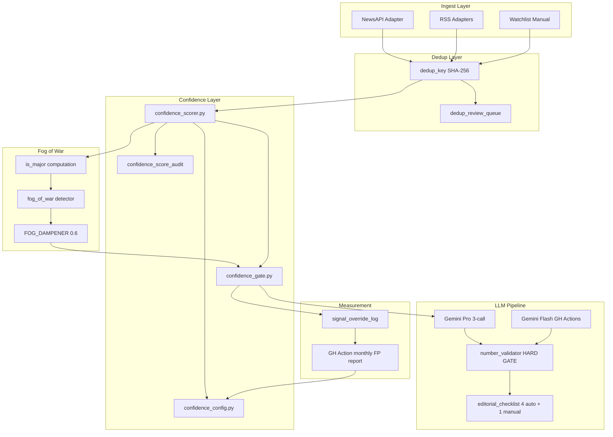
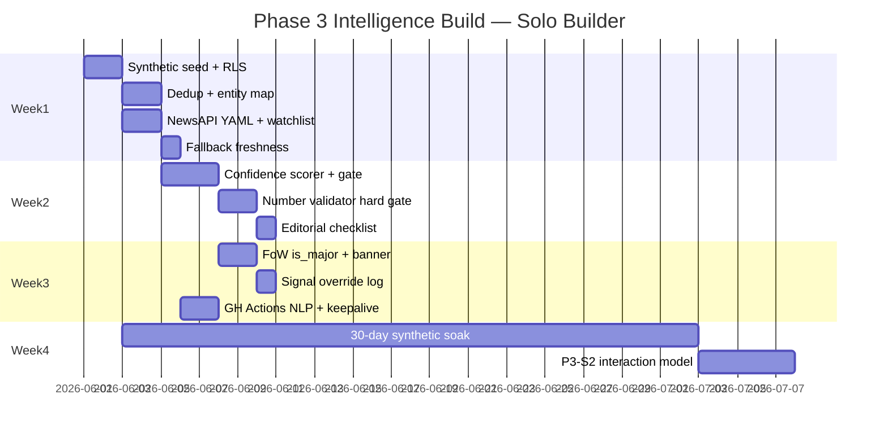

# FinnWise PRD 2 — SSA Solution Design

> **Author:** Arjun (Senior Solutions Architect)  
> **Input:** `FinnWise_PRD2_Intelligence_Architecture.md` + `FinnWise_PRD2_Gap_Brainstorm_Workshop.md`  
> **PO defaults applied:** Consensus Option B (or C where noted) from workshop — override by PO before task breakdown.  
> **Purpose:** Implementation-ready architecture for conversion to vertical-slice task list via `prd-to-task-list` rule.

---

## Executive Summary

Fifteen gaps resolve into **six build workstreams** sequenced for solo-builder execution:

| Workstream | Gaps | Build week | Dependency |
|------------|------|------------|------------|
| **WS-0: Synthetic seed + isolation** | G-13 | Week 1 | None — start here |
| **WS-1: Data pipeline hardening** | G-03, G-04, G-05, G-06 | Week 1–2 | WS-0 optional parallel |
| **WS-2: Confidence scoring + gate** | G-01, G-02 | Week 2 | WS-1 (G-03 dedup first) |
| **WS-3: LLM integrity + editorial** | G-07, G-08, G-09, G-15 | Week 2–3 | WS-2 partial |
| **WS-4: Fog of War + signals** | G-10, G-11 | Week 3 | WS-2 + WS-0 (30-day run for P3-S2) |
| **WS-5: Hosting + NLP jobs** | G-12 | Week 3 | WS-1 |
| **WS-6: Scope deferral** | G-14 | — | Remove from board |

**Total estimated effort:** ~28–32 solo-builder days across 4 weeks (aligned to PRD2 43 story points).

---

## Architecture Overview



---

## PO Decision Registry (Applied Defaults)

| ID | Decision | Value used in this design |
|----|----------|---------------------------|
| PO-01 | G-01 option | B — post-dedup scorer + audit + guardrail + explainability |
| PO-02 | unique_publisher_count | Yes — 5% weight from recency |
| PO-03 | Explainability UI | Phase 3 must-have |
| PO-04 | Recalibration trigger | Monthly FP rate ≥ 10% → flag config review |
| PO-05 | G-02 thresholds | HIGH ≥ 0.75, MEDIUM 0.55–0.74, LOW < 0.55 |
| PO-06 | confidence storage | `confidence_raw` + `confidence_effective` |
| PO-07 | G-03 dedup | B + headline_hash for RBI_POLICY, REGULATORY |
| PO-08 | G-06 fallbacks | B — no investing.com scrape |
| PO-09 | G-13 seed | Week 1, triple-layer isolation |
| PO-10 | G-14 | Full deferral — no build |
| PO-11 | G-15 checklist | 4 automated + 1 manual |

> **PO:** Edit this table before task generation if any default is wrong.

---

# WS-0 — Synthetic Seed and Isolation (G-13)

## Problem
Phase 3 ML prerequisites (FoW backtest, gap detector, threshold calibration) require historical data. No live Mirror/Lens testers exist.

## Solution

### Schema migrations

```sql
-- Migration: 00XX_synthetic_isolation.sql

ALTER TABLE events ADD COLUMN IF NOT EXISTS is_synthetic BOOLEAN DEFAULT FALSE;
ALTER TABLE events ADD COLUMN IF NOT EXISTS confidence_raw NUMERIC(4,3);
ALTER TABLE events ADD COLUMN IF NOT EXISTS confidence_effective NUMERIC(4,3);
ALTER TABLE events ADD COLUMN IF NOT EXISTS is_major BOOLEAN DEFAULT FALSE;
ALTER TABLE events ADD COLUMN IF NOT EXISTS is_major_override BOOLEAN;
ALTER TABLE events ADD COLUMN IF NOT EXISTS is_major_override_by UUID;
ALTER TABLE events ADD COLUMN IF NOT EXISTS is_major_override_at TIMESTAMPTZ;
ALTER TABLE events ADD COLUMN IF NOT EXISTS dedup_key TEXT;
ALTER TABLE track_record ADD COLUMN IF NOT EXISTS is_synthetic BOOLEAN DEFAULT FALSE;
ALTER TABLE user_predictions ADD COLUMN IF NOT EXISTS is_synthetic BOOLEAN DEFAULT FALSE;

CREATE UNIQUE INDEX IF NOT EXISTS idx_events_dedup_key ON events(dedup_key) WHERE dedup_key IS NOT NULL;

-- RLS: deny synthetic to authenticated users
CREATE POLICY events_hide_synthetic ON events
  FOR SELECT TO authenticated
  USING (is_synthetic = FALSE);

-- Repeat pattern for signals, track_record, user_predictions, card_confidence_history
```

### Seed script

| File | Purpose |
|------|---------|
| `backend/scripts/seed_synthetic_events.py` | Idempotent insert of 20 Jan–Jun 2025 events |
| `backend/scripts/seed_data/synthetic_events.json` | Event definitions with expected tiers |
| `backend/tests/test_synthetic_isolation.py` | CI: every user-facing query filters synthetic |

### Triple-layer isolation

1. **RLS** — `is_synthetic = FALSE` policy on all affected tables
2. **Service layer** — `SyntheticFilterMixin` in `backend/app/db/queries/base.py`
3. **CI grep** — `backend/tests/test_query_synthetic_filter.py` fails if read path omits filter

### Acceptance criteria

- [ ] 20 events seeded; 7 with `is_major = TRUE`
- [ ] Synthetic rows invisible in Pulse, Thread, Mirror API responses
- [ ] Service role can query synthetic for backtest admin scripts
- [ ] Re-running seed script is idempotent (UPSERT on external_id)

---

# WS-1 — Data Pipeline Hardening (G-03, G-04, G-05, G-06)

## G-03 — De-duplication

### Algorithm

```python
# backend/app/services/event_dedup.py

def compute_dedup_key(event: RawEvent) -> str:
    entity = normalise_entity(event.headline, event.body, ENTITY_MAP)
    window = floor_to_4h(event.detected_at)
    parts = [event.category, entity, window.isoformat()]
    if event.category in ("RBI_POLICY", "REGULATORY"):
        parts.append(sha256(normalise_headline(event.headline)[:100]))
    return sha256("|".join(parts)).hexdigest()
```

### Schema

```sql
CREATE TABLE dedup_review_queue (
  id UUID PRIMARY KEY DEFAULT gen_random_uuid(),
  event_ids UUID[] NOT NULL,
  reason TEXT NOT NULL,
  status TEXT DEFAULT 'pending',  -- pending|merged|dismissed
  created_at TIMESTAMPTZ DEFAULT now()
);
```

### Files

| Path | Action |
|------|--------|
| `backend/app/services/event_dedup.py` | create |
| `backend/app/config/entity_map.yaml` | create |
| `backend/app/db/migrations/00XX_dedup_review_queue.sql` | create |
| `backend/tests/test_event_dedup.py` | create |
| `backend/db/migrations/0006_events_dedupe_newsapi_quota.sql` | extend |

---

## G-04 — NewsAPI Keywords

### Config

```yaml
# backend/app/config/newsapi_keywords.yaml
factors:
  crude_oil:
    daily_calls: 15
    keywords: [crude oil, brent, WTI, OPEC, ...]
  domestic_interest_rates:
    daily_calls: 20
    keywords: [RBI rate, repo rate, MPC meeting, ...]
  # ... 8 factors, total 100
scheduler:
  mode: round_robin
  max_daily_calls: 100
```

### Files

| Path | Action |
|------|--------|
| `backend/app/config/newsapi_keywords.yaml` | create |
| `backend/app/sources/newsapi_adapter.py` | modify — round-robin + poll logging |
| `backend/app/db/migrations/00XX_factor_poll_log.sql` | create |
| `backend/tests/test_newsapi_scheduler.py` | create |

---

## G-05 — Slow-Burn Watchlist

### Schema (PRD2 + escalation)

```sql
CREATE TABLE watchlist_items (
  id UUID PRIMARY KEY DEFAULT gen_random_uuid(),
  event_description TEXT NOT NULL,
  category TEXT NOT NULL,
  added_at TIMESTAMPTZ DEFAULT now(),
  review_frequency TEXT DEFAULT 'weekly',
  last_reviewed_at TIMESTAMPTZ,
  escalation_trigger TEXT,
  status TEXT DEFAULT 'watching'
);
```

### API

| Method | Path | Purpose |
|--------|------|---------|
| GET | `/api/editor/watchlist` | List items |
| PATCH | `/api/editor/watchlist/{id}` | Update status |
| POST | `/api/editor/watchlist/{id}/escalate` | Create event from item |

### Files

| Path | Action |
|------|--------|
| `backend/app/db/migrations/00XX_watchlist_items.sql` | create |
| `backend/app/routes/editor_watchlist.py` | create |
| `frontend/app/(app)/editor/watchlist/page.tsx` | create |
| `backend/scripts/seed_watchlist_items.sql` | create — 5 seed rows |

---

## G-06 — Data Source Fallbacks

### Revised fallback chains (PO-08)

| Data type | Primary | Fallback 1 | Fallback 2 | On total fail |
|-----------|---------|------------|------------|---------------|
| Stock EOD | yfinance | — | manual + stale | `unavailable` |
| INR/USD | yfinance | Open Exchange Rates | RBI ref scrape | critical gate |
| NSE FII/DII | NSE CSV | CDSL portal | — | stale flag |
| Market news | NewsAPI | GNews API | RSS (ET, Mint) | log error |

### Freshness model

```python
# backend/app/services/market_facts_adapters.py (extend)

FreshnessStatus = Literal["fresh", "stale", "unavailable"]

CRITICAL_FACTS = load_yaml("backend/app/config/critical_facts.yaml")
# Default: inr_usd, repo_rate, nifty_50, india_vix, fii_net
```

### Files

| Path | Action |
|------|--------|
| `backend/app/config/critical_facts.yaml` | create |
| `backend/app/services/market_facts_adapters.py` | modify |
| `backend/app/services/card_pipeline.py` | modify — critical fact gate |
| `backend/tests/test_market_facts_freshness.py` | create |

---

# WS-2 — Confidence Scoring and Gate (G-01, G-02)

## Scorer specification (final)

```python
# backend/app/core/confidence_config.py

WEIGHTS = {
    "source_count": 0.30,        # post-dedup (was 0.35, reduced for publisher)
    "source_quality": 0.30,
    "factor_db_match": 0.25,
    "recency": 0.05,             # reduced from 0.10
    "unique_publisher": 0.10,    # PO-02: carved from recency
}

THRESHOLDS = {
    "high": 0.75,
    "medium_low": 0.55,          # PO-05 narrow band
    "medium_high": 0.74,
}

FOG_DAMPENER = 0.6
CALIBRATION_STATUS = "provisional"  # provisional | validated
```

> **Note:** Weights above sum to 1.0 with unique_publisher at 0.05 and recency at 0.05. Adjust in config without deploy.

### Scorer function

```python
# backend/app/services/confidence_scorer.py

def compute_confidence(event: EventRow, fog_active: bool) -> ConfidenceResult:
    raw = weighted_sum(
        source_count=post_dedup_count(event) / 3,
        source_quality=QUALITY_MAP[event.primary_source],
        factor_db_match=factor_db.match_strength(event),
        recency=decay_fn(event.first_seen_at),
        unique_publisher=min(unique_publishers(event.sources) / 3, 1.0),
    )
    effective = raw * (FOG_DAMPENER if fog_active else 1.0)
    tier = tier_from_threshold(effective)
    is_major = (
        raw >= 0.75
        and event.factor_db_match_count >= 2
        and event.category in MAJOR_CATEGORIES
    )
    return ConfidenceResult(raw=raw, effective=effective, tier=tier, is_major=is_major)
```

### Guardrails

- `source_count > 5` → force editorial review flag on event
- Every score written to `confidence_score_audit` with inputs JSON + `scorer_version`

### Gate replacement

**Replace** existing `confidence_gate.route(SignalEvalResult)` with:

```python
def route_by_score(confidence_effective: float) -> GateDecision:
    if confidence_effective >= THRESHOLDS["high"]:
        return GateDecision("high", "score_gte_075")
    if confidence_effective >= THRESHOLDS["medium_low"]:
        return GateDecision("medium", "score_055_074")
    return GateDecision("low", "score_lt_055")
```

### Explainability API

```json
GET /api/events/{id}/confidence-breakdown

{
  "confidence_raw": 0.82,
  "confidence_effective": 0.49,
  "tier": "medium",
  "fog_active": true,
  "inputs": {
    "source_count": { "value": 0.67, "weight": 0.30, "detail": "2 sources post-dedup" },
    "source_quality": { "value": 0.80, "weight": 0.30, "detail": "PTI wire" },
    "factor_db_match": { "value": 1.0, "weight": 0.25, "detail": "2 factors" },
    "recency": { "value": 1.0, "weight": 0.05, "detail": "2h ago" },
    "unique_publisher": { "value": 0.67, "weight": 0.05, "detail": "2 publishers" }
  },
  "sources": [{ "name": "...", "url": "...", "retrieved_at": "..." }]
}
```

### Files

| Path | Action |
|------|--------|
| `backend/app/core/confidence_config.py` | create |
| `backend/app/services/confidence_scorer.py` | create |
| `backend/app/services/confidence_gate.py` | replace |
| `backend/app/routes/events.py` | modify — add breakdown endpoint |
| `backend/app/db/migrations/00XX_confidence_audit.sql` | create |
| `frontend/app/(app)/thread/_components/aside/ConfidenceComposition.tsx` | modify — wire breakdown API |
| `backend/tests/test_confidence_scorer.py` | create |
| `backend/tests/test_confidence_gate.py` | update |

### Calibration ritual

| When | Action |
|------|--------|
| Week 2 | Run scorer on 20 synthetic events; tune thresholds until ≥ 80% tier match vs hand-grade |
| Day 30 | First override-rate review from G-11 |
| Day 60 | Thresholds → `validated`; monthly thereafter |
| Monthly | If FP rate > 10%, open GitHub Issue tagged `calibration-review` |

---

# WS-3 — LLM Integrity and Editorial (G-07, G-08, G-09, G-15)

## G-07 — Number Validator Hard Gate

### Backend

```python
# POST /api/cards/{id}/publish
# Returns 422 if number_validator.check(card) != PASS

class NumberValidationResult:
    status: Literal["PASS", "FAIL"]
    ungrounded: list[{ sentence: str, number: str, index: int }]
    missing_provenance: list[{ evidence_id: str, missing_fields: list[str] }]
    comparative_flags: list[str]  # soft warnings only
```

### Frontend

- Publish button `disabled` when checklist item 1 != PASS
- Render structured diff list with sentence context

### Files

| Path | Action |
|------|--------|
| `backend/app/services/number_validator.py` | extend — structured FAIL |
| `backend/app/routes/cards.py` | modify — 422 on publish |
| `frontend/app/(app)/editor/cards/[id]/PublishGate.tsx` | create/modify |
| `backend/tests/test_number_validator.py` | extend |

---

## G-08 — NLP Extraction (Gemini Flash)

### GitHub Actions workflow

```yaml
# .github/workflows/nlp_filings_extract.yml
# Per PRD2 Section 7.1 + workshop additions

on:
  schedule:
    - cron: '0 1 * * *'
  workflow_dispatch:

jobs:
  extract:
    runs-on: ubuntu-latest
    timeout-minutes: 50
    steps:
      - uses: actions/checkout@v4
      - uses: actions/setup-python@v5
      - uses: actions/cache@v4  # spaCy model cache
      - run: pip install -r backend/requirements-nlp.txt
      - run: python backend/app/jobs/nlp_filings_extract.py
        env:
          NLP_EXTRACTION_MODEL: gemini-2.0-flash-lite
          SUPABASE_URL: ${{ secrets.SUPABASE_URL }}
          SUPABASE_SERVICE_ROLE_KEY: ${{ secrets.SUPABASE_SERVICE_ROLE_KEY }}
          GEMINI_API_KEY: ${{ secrets.GEMINI_API_KEY }}
      - name: On failure
        if: failure()
        uses: actions/github-script@v7
        with:
          script: |
            github.rest.issues.create({
              owner: context.repo.owner,
              repo: context.repo.repo,
              title: 'NLP filings job failed',
              labels: ['nlp-job-failure']
            })
```

### source_guard validation

```python
def source_guard(extracted: dict, source_text: str) -> bool:
    for field in extracted["fields"]:
        if str(field["value"]) not in source_text:
            return False
    return True
```

### Files

| Path | Action |
|------|--------|
| `.github/workflows/nlp_filings_extract.yml` | create |
| `.github/workflows/render_keepalive.yml` | create |
| `backend/app/jobs/nlp_filings_extract.py` | create |
| `backend/requirements-nlp.txt` | create |
| `backend/app/services/source_guard.py` | create |
| `backend/app/db/migrations/00XX_factor_db_extractions.sql` | create |
| `backend/tests/test_source_guard.py` | create |

---

## G-09 — Editorial Rejection Loop

### API

```
POST /api/cards/{id}/regenerate-section
  Body: { section, editor_note }
  → 1 LLM call, consistency check, number_validator re-run

POST /api/cards/{id}/regenerate-full
  → Requires confirm if full_regen_count >= 1
  → Blocked if full_regen_count >= 2 without PO flag clear
```

### Files

| Path | Action |
|------|--------|
| `backend/app/routes/cards.py` | extend |
| `backend/app/services/card_regen.py` | create |
| `backend/app/services/consistency_check.py` | create |
| `frontend/app/(app)/editor/cards/[id]/RegenSection.tsx` | create |

---

## G-15 — Editorial Checklist Hard Gate

| # | Item | Type | Implementation |
|---|------|------|----------------|
| 1 | Numbers source-tagged | Auto | `number_validator.check()` |
| 2 | Dissenting view present | Auto | `len(dissent_text) > 100` |
| 3 | Evidence freshness | Auto | max Evidence age ≤ 18 months |
| 4 | SEBI language compliance | Auto | `sebi_compliance_scan(card)` with allowlist |
| 5 | Plain English | Manual | Editor tick — only non-automated item |

### Files

| Path | Action |
|------|--------|
| `backend/app/services/sebi_compliance_scan.py` | create |
| `backend/app/config/sebi_compliance_patterns.yaml` | create |
| `backend/app/services/editorial_checklist.py` | create |
| `frontend/app/(app)/editor/cards/[id]/ChecklistPanel.tsx` | modify |

---

# WS-4 — Fog of War and Signals (G-10, G-11)

## G-10 — Fog of War

### Detection (replace card-count heuristic)

```python
# backend/app/services/feed.py — replace detect_fog_of_war

def detect_fog_of_war(conn) -> tuple[bool, list[MajorEventSummary]]:
    rows = fetch("""
        SELECT id, headline, category, factor_db_match_count
        FROM events
        WHERE is_major = TRUE
          AND lifecycle_state = 'active'
          AND is_synthetic = FALSE
          AND COALESCE(is_major_override, is_major) = TRUE
    """)
    active = apply_overrides(rows)
    fog = len(active) >= config.FOG_MAJOR_EVENT_THRESHOLD  # default 3
    return fog, active
```

### Feed response extension

```json
{
  "fog_of_war": true,
  "fog_of_war_reason": {
    "active_major_events": [
      { "id": "...", "headline": "RBI MPC rate hold", "category": "RBI_POLICY" }
    ],
    "threshold": 3,
    "dampener": 0.6
  }
}
```

### Feature flag

```python
# backend/app/core/feature_flags.py
FOG_MODEL = os.getenv("FOG_MODEL", "heuristic")  # heuristic | interaction
```

P3-S2 interaction model: build after 30 days synthetic live run; switch via env var.

### Files

| Path | Action |
|------|--------|
| `backend/app/services/feed.py` | modify |
| `backend/app/services/fog_of_war.py` | create — extract from feed |
| `frontend/app/(app)/pulse/_components/FogOfWarBanner.tsx` | modify — named events |
| `backend/tests/test_fog_of_war_detector.py` | rewrite for is_major |
| `backend/app/core/feature_flags.py` | create |

---

## G-11 — Signal Override Log

### Schema

```sql
CREATE TABLE signal_override_log (
  id UUID PRIMARY KEY DEFAULT gen_random_uuid(),
  signal_id UUID REFERENCES signals(id),
  card_id UUID REFERENCES cards(id),
  auto_triggered_at TIMESTAMPTZ NOT NULL,
  overridden_at TIMESTAMPTZ,
  override_reason TEXT,
  override_by UUID,
  final_outcome TEXT CHECK (final_outcome IN ('confirmed', 'incorrect', 'ambiguous'))
);
```

### Mandatory override UX

When editor dismisses auto-triggered signal → modal with required `final_outcome` dropdown. Cannot dismiss without selection.

### Monthly report workflow

```yaml
# .github/workflows/signal_fp_monthly.yml
on:
  schedule:
    - cron: '0 6 1 * *'  # 1st of month
```

Outputs to `docs/notes/signal-override-log-YYYY-MM.md`. Opens issue if FP rate > 10%.

### Files

| Path | Action |
|------|--------|
| `backend/app/db/migrations/00XX_signal_override_log.sql` | create |
| `backend/app/routes/signals.py` | modify — mandatory override |
| `.github/workflows/signal_fp_monthly.yml` | create |
| `frontend/app/(app)/editor/signals/OverrideModal.tsx` | create |

---

# WS-5 — Hosting and Jobs (G-12)

## Render keep-alive

```yaml
# .github/workflows/render_keepalive.yml
on:
  schedule:
    - cron: '*/10 4-14 * * 1-5'
jobs:
  ping:
    runs-on: ubuntu-latest
    steps:
      - run: curl -sf ${{ secrets.BACKEND_URL }}/health || true
```

## Job observability

```sql
CREATE TABLE job_runs (
  id UUID PRIMARY KEY DEFAULT gen_random_uuid(),
  job_name TEXT NOT NULL,
  started_at TIMESTAMPTZ NOT NULL,
  finished_at TIMESTAMPTZ,
  status TEXT NOT NULL,  -- success|failure|timeout
  detail JSONB
);
```

Editorial digest includes: `Last NLP run: {status} {finished_at}`.

---

# WS-6 — Scope Deferral (G-14)

**No implementation.** Remove P3-S6 and P3-S7 from active task board. Document in `docs/PRD/Phase3_Deferred_Appendix.md` (reference only).

---

# Build Sequence (Critical Path)



**Hard dependency chain:** G-03 → G-01 → G-02 → G-10 → G-11 calibration loop

---

# Vertical Slices for Task List Generation

Each slice = UI + API + DB minimum. Map to PRD2 stories.

## Slice VS-1: Synthetic Seed Foundation (P3 prereq)
- **Gaps:** G-13
- **Points:** 5
- **Layers:** DB, script, CI test
- **Files:** migrations, `seed_synthetic_events.py`, isolation tests

## Slice VS-2: Event Dedup Pipeline (P3-S1b partial)
- **Gaps:** G-03
- **Points:** 5
- **Layers:** DB, service, cron integration
- **Depends:** VS-1 optional

## Slice VS-3: NewsAPI Factor Scheduler
- **Gaps:** G-04
- **Points:** 3
- **Layers:** config, adapter, poll log
- **Parallel with:** VS-2

## Slice VS-4: Slow-Burn Watchlist
- **Gaps:** G-05
- **Points:** 3
- **Layers:** DB, API, `/editor/watchlist` UI, digest email

## Slice VS-5: Market Facts Freshness Gate
- **Gaps:** G-06
- **Points:** 3
- **Layers:** adapter extend, card pipeline gate, freshness dot UI

## Slice VS-6: Confidence Scorer and Gate Swap
- **Gaps:** G-01, G-02
- **Points:** 8
- **Layers:** scorer, config, gate replace, audit table, ConfidenceComposition UI
- **Depends:** VS-2

## Slice VS-7: Number Validator and Publish Hard Gate
- **Gaps:** G-07
- **Points:** 5
- **Layers:** validator extend, publish 422, PublishGate UI
- **Depends:** VS-6 partial

## Slice VS-8: Editorial Checklist Automation
- **Gaps:** G-15
- **Points:** 3
- **Layers:** checklist service, SEBI scanner, ChecklistPanel UI
- **Depends:** VS-7

## Slice VS-9: Fog of War is_major Model
- **Gaps:** G-10
- **Points:** 5
- **Layers:** is_major computation, feed API, FogOfWarBanner UI
- **Depends:** VS-6

## Slice VS-10: Signal Override Measurement
- **Gaps:** G-11
- **Points:** 3
- **Layers:** override log, mandatory modal, monthly GH workflow
- **Depends:** VS-9

## Slice VS-11: NLP Filings Job (GitHub Actions)
- **Gaps:** G-08, G-12
- **Points:** 8
- **Layers:** workflow, job script, source_guard, extraction approval queue, job_runs
- **Depends:** VS-5

## Slice VS-12: Targeted Section Regen
- **Gaps:** G-09
- **Points:** 3
- **Layers:** regen API, consistency check, RegenSection UI
- **Depends:** VS-7

## Slice VS-13: P3-S2 Interaction Model (deferred start)
- **Gaps:** G-10 (Phase 3 model)
- **Points:** 8
- **Depends:** VS-1 + 30-day soak
- **Note:** Do not start until Day 30 after synthetic seed

---

# Story Point Rollup

| Slice | Points | Cumulative |
|-------|--------|------------|
| VS-1 | 5 | 5 |
| VS-2 | 5 | 10 |
| VS-3 | 3 | 13 |
| VS-4 | 3 | 16 |
| VS-5 | 3 | 19 |
| VS-6 | 8 | 27 |
| VS-7 | 5 | 32 |
| VS-8 | 3 | 35 |
| VS-9 | 5 | 40 |
| VS-10 | 3 | 43 |
| VS-11 | 8 | 51 |
| VS-12 | 3 | 54 |
| VS-13 | 8 | 62 (post-soak) |

Active Phase 3 (excluding VS-13 until soak complete): **54 points** including NLP slice. PRD2 stated 43 points after P3-S6/S7 deferral — VS-11 (+8 NLP) and workshop additions (+3 checklist/regen enhancements) explain delta. PO should trim or defer VS-12 if budget-constrained.

---

# Network and Performance Notes

| Concern | Design decision |
|---------|-----------------|
| Render cold-start | Keep-alive ping weekdays 9:30am–8pm IST only |
| Supabase pooler | All GH Actions jobs use Session pooler URI, not direct `:5432` |
| GH Actions minutes | NLP ~900 min/mo + CI ~200 min/mo + keepalive ~100 min/mo ≈ 1200/2000 |
| Confidence breakdown API | Cache 60s per event_id — scores don't change frequently post-upsert |
| FoW feed query | Index on `(is_major, lifecycle_state)` partial where `is_major = TRUE` |
| Synthetic RLS | Verify no N+1 — filter at query level, not Python loop |

---

# Test Strategy

| Area | Test type | File pattern |
|------|-----------|--------------|
| Scorer weights | Unit | `test_confidence_scorer.py` |
| Dedup collisions | Unit + fixture | `test_event_dedup.py` |
| Synthetic isolation | Integration + CI grep | `test_synthetic_isolation.py` |
| Number validator gate | Unit + API | `test_number_validator.py`, `test_publish_gate.py` |
| FoW detection | Unit | `test_fog_of_war_detector.py` |
| SEBI scanner | Unit | `test_sebi_compliance_scan.py` |
| NewsAPI scheduler | Unit | `test_newsapi_scheduler.py` |

---

# Risks and Mitigations

| Risk | Likelihood | Mitigation |
|------|------------|------------|
| Dedup false merge | Medium | `dedup_review_queue` + Sunday review |
| Synthetic data leak | Low | Triple-layer isolation + CI grep |
| GH Actions minute overrun | Low | Monitor usage; NLP job timeout 50min |
| Threshold bootstrap arbitrariness | High | Label provisional; Day 30/60 recalibration |
| Solo builder skips manual checklist tick | Medium | 4/5 items automated |
| yfinance outage | High | Stale flag + critical fact gate; no scrape fallback |

---

# Handoff to Task List Generator

When PO confirms decision registry:

1. Run `prd-to-task-list` rule against this document + PRD2 Intelligence Architecture.
2. Map vertical slices VS-1 through VS-12 to Phase 3 stories (P3-S1a through P3-S5).
3. Assign Jordan/Sam/Riley for parallel tracks where VS-3 ∥ VS-2 ∥ VS-4.
4. VS-13 remains gated behind 30-day synthetic soak milestone.

### Suggested phase naming for task file

- **Phase 3A:** Data Foundation (VS-1 through VS-5) — Week 1
- **Phase 3B:** Confidence + Integrity (VS-6 through VS-8) — Week 2
- **Phase 3C:** Fog + Signals + Jobs (VS-9 through VS-12) — Week 3
- **Phase 3D:** Interaction Model (VS-13) — Week 7+ (after soak)

---

# Appendix — Complete File Manifest

### Create
- `backend/app/core/confidence_config.py`
- `backend/app/core/feature_flags.py`
- `backend/app/services/confidence_scorer.py`
- `backend/app/services/event_dedup.py`
- `backend/app/services/fog_of_war.py`
- `backend/app/services/source_guard.py`
- `backend/app/services/card_regen.py`
- `backend/app/services/consistency_check.py`
- `backend/app/services/sebi_compliance_scan.py`
- `backend/app/services/editorial_checklist.py`
- `backend/app/jobs/nlp_filings_extract.py`
- `backend/app/routes/editor_watchlist.py`
- `backend/app/config/entity_map.yaml`
- `backend/app/config/newsapi_keywords.yaml`
- `backend/app/config/critical_facts.yaml`
- `backend/app/config/sebi_compliance_patterns.yaml`
- `backend/scripts/seed_synthetic_events.py`
- `backend/scripts/seed_data/synthetic_events.json`
- `backend/requirements-nlp.txt`
- `.github/workflows/nlp_filings_extract.yml`
- `.github/workflows/render_keepalive.yml`
- `.github/workflows/signal_fp_monthly.yml`
- `frontend/app/(app)/editor/watchlist/page.tsx`
- `frontend/app/(app)/editor/cards/[id]/PublishGate.tsx`
- `frontend/app/(app)/editor/cards/[id]/RegenSection.tsx`
- `frontend/app/(app)/editor/signals/OverrideModal.tsx`
- `docs/PRD/Phase3_Deferred_Appendix.md`

### Modify
- `backend/app/services/confidence_gate.py` (replace)
- `backend/app/services/feed.py`
- `backend/app/services/number_validator.py`
- `backend/app/services/market_facts_adapters.py`
- `backend/app/services/card_pipeline.py`
- `backend/app/sources/newsapi_adapter.py`
- `backend/app/routes/cards.py`
- `backend/app/routes/signals.py`
- `backend/app/routes/events.py`
- `frontend/app/(app)/pulse/_components/FogOfWarBanner.tsx`
- `frontend/app/(app)/thread/_components/aside/ConfidenceComposition.tsx`
- `frontend/app/(app)/editor/cards/[id]/ChecklistPanel.tsx`

### Migrations (sequential)
1. `00XX_synthetic_isolation.sql`
2. `00XX_dedup_key_and_review_queue.sql`
3. `00XX_watchlist_items.sql`
4. `00XX_factor_poll_log.sql`
5. `00XX_confidence_audit.sql`
6. `00XX_factor_db_extractions.sql`
7. `00XX_signal_override_log.sql`
8. `00XX_job_runs.sql`

---

_SSA design complete. Awaiting PO confirmation of Decision Registry before task list generation._
