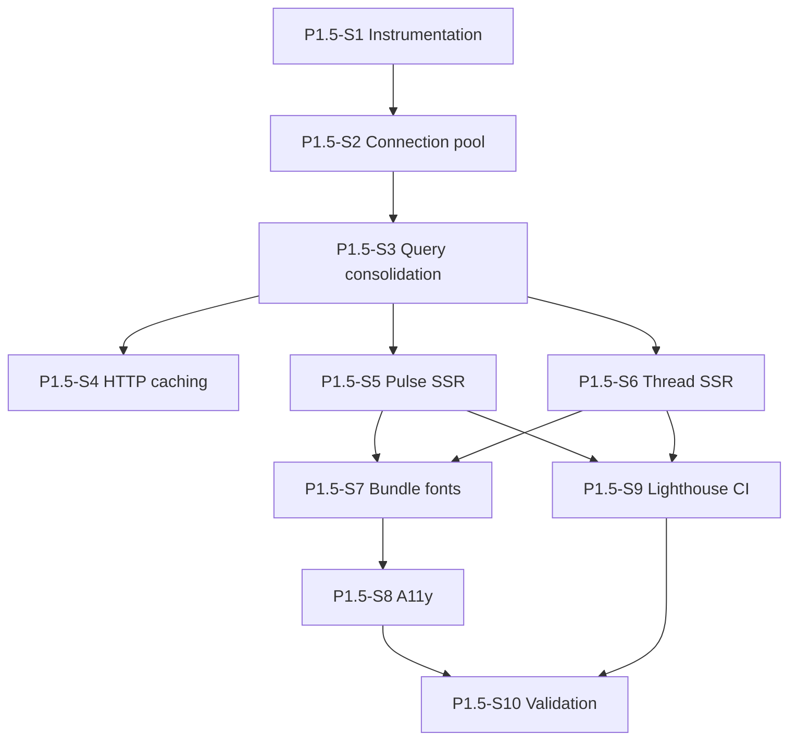

# FinnWise — Phase 1.5 Implementation Tasks (Performance Remediation, Pulse + Thread)

_Source evidence_: Lighthouse traces in `Page Load Performance/` (2026-05-23) — Pulse (`/pulse`) and Thread (`/thread/{cardId}`).
_Phase placement_: Between Phase 1 (foundation shipped) and Phase 2 (engagement layer). Aligns with Phase 2 story P2-S12 (Lighthouse ≥90) but delivers the performance foundation early.
_generated for independent execution without prd-planner_

## Overview

- **Summary**: Phase 1.5 remediates production load performance on **The Pulse** and **The Thread**. Lighthouse mobile traces show Performance scores of **82 (Pulse)** and **78 (Thread)** with meaningful content appearing at **~9s**, despite fast HTML delivery (~40ms). Root cause is a **client-fetch-after-hydration waterfall** plus **~8s API latency** through the Vercel `/backend` proxy to Render, driven by **multiple new Postgres connections per API request** (no pool). This phase adds connection pooling, query consolidation, server-side data loading (RSC), bundle/font optimization, Lighthouse CI budgets, and targeted a11y fixes — without changing MMJ, SEBI, bias-flag, or track-record behavior.

- **Tech stack**: unchanged from Phase 1 — Next.js 14 + Tailwind (Vercel), FastAPI (Render), Supabase Postgres, single `.env.local`. New dependency: `psycopg-pool` (backend).

- **Slicing approach**: every story is an end-to-end vertical slice with explicit test/validation steps. Parent task IDs are **per-phase** — this file uses **1.5.0**–**1.5.10** (story labels P1.5-S1 … P1.5-S10). Performance budgets are non-negotiable acceptance criteria.

- **Prerequisite**: Phase 1 Pulse + Thread surfaces deployed to Vercel/Render with working `/api/feed` and `/api/cards/{id}` paths.

### Baseline metrics (Lighthouse mobile, 2026-05-23)

| Surface | Performance | Speed Index | TBT | API wait | Final content |
|---------|-------------|-------------|-----|----------|---------------|
| Pulse | 82 | 5.8s | 520ms | `/backend/api/feed` ~8.3s | ~9.3s |
| Thread | 78 | 5.0s | 710ms | `/backend/api/cards/{id}` ~7.7s | ~9.1s |

Thread was measured ~90s after Pulse; both API calls still took ~7.7–8.3s — **not a one-off cold start**.

## Team plan

| Developer | Focus | Total points |
|-----------|-------|---------------|
| Jordan | Connection pool, query consolidation, HTTP caching on read paths | 10 |
| Sam | Pulse/Thread SSR data loading, bundle/code-split, fonts, a11y quick wins | 13 |
| Riley | Latency instrumentation, Lighthouse CI harness, production validation | 6 |

---

## Phase 1.5: Performance Remediation

_Fix the ~8s API path and client-side data waterfall so Pulse and Thread reach meaningful content in under 2.5s and Lighthouse Performance ≥90 on mobile._ · **Duration estimate:** 2–3 weeks.

### Definition of Done (phase-wide)

- [ ] Pulse and Thread Lighthouse **Performance ≥90** (mobile, production URLs).
- [ ] **Speed Index <3.4s**, **TBT <200ms** on both surfaces.
- [ ] **Time to meaningful content <2.5s** (feed cards visible / card title + ICE header visible).
- [ ] Warm API **p95 <800ms** for `/api/feed` and `/api/cards/{id}` (measured via bench script + server timing headers).
- [ ] Existing pytest/Jest suites green; new perf/a11y tests added where specified.
- [ ] No regression to MMJ, SEBI, bias-flag, or track-record behavior.

---

### Story P1.5-S1 — Baseline instrumentation and latency proof

- **Assigned:** Riley
- **Points:** 2
- **Layers:** Ops, API (diagnostics)
- **Depends on:** _None_
- **Parallel with:** _None — run first_

**User story**

> As the platform owner, I want measured proof of where the ~8s API latency comes from (connect vs query vs proxy), so that we fix the validated branch instead of stacking speculative optimizations.

**Acceptance criteria**

- [x] `/api/feed` and `/api/cards/{id}` responses include timing headers (`Server-Timing` or `X-FinnWise-Timing`) with `db_connect_ms`, `db_query_ms`, `total_ms`.
- [x] `GET /health/db` returns connect + query breakdown (not just card count).
- [x] `scripts/bench_api_latency.mjs` (or `.py`) runs 5 warm requests against Render direct and Vercel `/backend/...` proxy.
- [x] Run steps documented in `scripts/README.md`.

**Tech notes**

- Measure before refactoring. If all 5 warm requests are ~8s, suspect connection churn or proxy — not query complexity (payloads are 1–4 KB).
- Confirm Render `SUPABASE_DB_URL` uses Session pooler URI (`pooler.supabase.com:5432`) per `scripts/README.md`.

#### Relevant files

| Path | Type | Purpose |
|------|------|---------|
| `backend/app/api/feed.py` | modify | Attach timing headers to feed response |
| `backend/app/api/cards_detail.py` | modify | Attach timing headers to card detail response |
| `backend/app/main.py` | modify | Extend `/health/db` with timed connect |
| `scripts/bench_api_latency.mjs` | create | Warm-request latency bench (direct + proxy) |
| `scripts/README.md` | modify | Document bench + Lighthouse run steps |

#### Tasks (checkboxes)

- [x] **1.5.1** Baseline instrumentation and latency proof
  - [x] **1.5.1.1** Add timing middleware or per-route timing capture in feed + card detail handlers.
  - [x] **1.5.1.2** Extend `GET /health/db` with `connect_ms` and `query_ms` fields.
  - [x] **1.5.1.3** Create `scripts/bench_api_latency.mjs` — 5 iterations, reports p50/p95 for feed + card detail (direct + proxy).
  - [x] **1.5.1.4** Document usage in `scripts/README.md`.
  - [x] **1.5.1.5** Capture baseline numbers in PR description or scratch note before S2 starts.

---

### Story P1.5-S2 — Postgres connection pool

- **Assigned:** Jordan
- **Points:** 3
- **Layers:** DB, API
- **Depends on:** P1.5-S1 (baseline captured)
- **Parallel with:** _None_

**User story**

> As a user loading Pulse or Thread, I want the backend to reuse database connections instead of opening a new TCP/TLS session per query, so that API responses return in sub-second time on warm requests.

**Acceptance criteria**

- [x] `psycopg-pool` added to `backend/pyproject.toml`.
- [x] `ConnectionPool` initialized on FastAPI lifespan startup; closed on shutdown.
- [x] Existing `connection()` context manager acquires from pool (API unchanged for callers).
- [x] `prepare_threshold=None` preserved for port 6543 (transaction pooler).
- [x] Warm `/health/db` connect time drops sharply vs P1.5-S1 baseline.
- [x] All existing backend DB tests pass.

**Tech notes**

- Current pattern in `backend/app/db/connection.py` opens and closes `psycopg.connect()` on every `with connection()` block — feed uses **4 connections** per request; card detail uses **3–4+**.

#### Relevant files

| Path | Type | Purpose |
|------|------|---------|
| `backend/pyproject.toml` | modify | Add `psycopg-pool` dependency |
| `backend/app/db/connection.py` | modify | Pool acquire/release via context manager |
| `backend/app/main.py` | modify | FastAPI lifespan: init/close pool |
| `backend/tests/test_health.py` | modify | Assert pool lifecycle does not break `/health/db` |

#### Tasks (checkboxes)

- [x] **1.5.2** Postgres connection pool
  - [x] **1.5.2.1** Add `psycopg-pool` to dependencies; reinstall backend editable.
  - [x] **1.5.2.2** Implement pool singleton + lifespan hooks in `main.py`.
  - [x] **1.5.2.3** Refactor `connection()` to use pool without changing call-site signatures.
  - [x] **1.5.2.4** Re-run bench script; confirm connect_ms drop on warm requests.
  - [x] **1.5.2.5** Run `pytest -q` — all green.

---

### Story P1.5-S3 — Consolidate feed and card-detail queries

- **Assigned:** Jordan
- **Points:** 5
- **Layers:** Services, API, DB
- **Depends on:** P1.5-S2
- **Parallel with:** _None_

**User story**

> As a user, I want each Pulse feed and Thread card API call to use a single database connection and minimal round-trips, so that pooled connections translate into fast end-to-end response times.

**Acceptance criteria**

- [x] `build_feed_response` runs all feed queries in **one** connection scope (session profile, pulse rows, instrument assessments, fog-of-war).
- [x] `build_card_detail` (current view) uses a new `fetch_card_detail_bundle(card_id)` — card + signals + instruments + bias flags in one connection.
- [x] `build_bias_audit` accepts pre-fetched rows when `card_id` is passed (no extra connection).
- [x] `view=original` track_record snapshot path unchanged.
- [x] Warm feed API p95 **<800ms**; warm card detail p95 **<800ms** (bench script).
- [x] Timing headers show **1 connection** per request.
- [x] Feed + card detail response JSON shapes unchanged (existing tests pass).

**Tech notes**

- Feed today: `fetch_session_profile`, `fetch_pulse_rows`, `_assessments_for_cards`, `fetch_fog_of_war_flag` — each opens `connection()` separately in `backend/app/services/feed.py`.
- Card detail today: `fetch_card_detail_for_review`, `fetch_signals_for_card`, `fetch_instrument_assessments_for_card`, `build_bias_audit(card_id=…)` — separate connections.

#### Relevant files

| Path | Type | Purpose |
|------|------|---------|
| `backend/app/services/feed.py` | modify | Single-connection feed build |
| `backend/app/services/card_detail.py` | modify | Bundle fetch + bias audit injection |
| `backend/app/services/card_repository.py` | modify | `fetch_card_detail_bundle()` |
| `backend/app/services/bias_detector.py` | modify | Optional pre-fetched bias rows |
| `backend/tests/test_feed_filtering.py` | modify | Response shape regression |
| `backend/tests/test_card_detail_original_immutable.py` | modify | Current/original view regression |

#### Tasks (checkboxes)

- [x] **1.5.3** Consolidate feed and card-detail queries
  - [x] **1.5.3.1** Refactor `build_feed_response` to optional shared `conn`; collapse to one `with connection()` block.
  - [x] **1.5.3.2** Add `fetch_card_detail_bundle(card_id)` in `card_repository.py`.
  - [x] **1.5.3.3** Wire bundle into `build_card_detail`; pass bias rows to `build_bias_audit`.
  - [x] **1.5.3.4** Verify timing headers: one connect per request.
  - [x] **1.5.3.5** Run bench script — p95 <800ms warm on Render.
  - [x] **1.5.3.6** Run feed + card detail pytest suites.

---

### Story P1.5-S4 — HTTP caching for published read paths

- **Assigned:** Jordan
- **Points:** 2
- **Layers:** API, HTTP
- **Depends on:** P1.5-S3
- **Parallel with:** P1.5-S5, P1.5-S6

**User story**

> As a returning user navigating between Pulse cards, I want recently loaded feed and card data served from cache where safe, so that repeat views feel instant without showing stale editorial drafts.

**Acceptance criteria**

- [x] Published/active lifecycle feed and card detail responses include `Cache-Control: private, max-age=60, stale-while-revalidate=300`.
- [x] Draft/admin paths retain `no-store`.
- [x] Client refetch paths (filter change, view toggle, retry) still use `cache: "no-store"`.
- [x] bf-cache Lighthouse warning documented as acceptable (freshness trade-off).

#### Relevant files

| Path | Type | Purpose |
|------|------|---------|
| `backend/app/api/feed.py` | modify | Cache headers on feed |
| `backend/app/api/cards_detail.py` | modify | Cache headers on card detail |
| `frontend/lib/api/server.ts` | create (S5) | SSR fetch with `revalidate: 60` |

#### Tasks (checkboxes)

- [x] **1.5.4** HTTP caching for published read paths
  - [x] **1.5.4.1** Add cache header helper keyed on lifecycle state.
  - [x] **1.5.4.2** Apply to feed + card detail routes only for published/active cards.
  - [x] **1.5.4.3** Confirm admin/draft routes unchanged.
  - [x] **1.5.4.4** Test: second request within 60s shows cache hit (browser or curl `-H 'Cache-Control:'`).

---

### Story P1.5-S5 — Server-side data loading for Pulse

- **Assigned:** Sam
- **Points:** 4
- **Layers:** UI, API (consumer)
- **Depends on:** P1.5-S3 (fast API); P1.5-S4 optional for SSR cache
- **Parallel with:** P1.5-S6

**User story**

> As a user opening The Pulse, I want event cards visible on first paint without waiting for JavaScript to hydrate and fetch, so that the feed feels production-ready on mobile.

**Acceptance criteria**

- [x] `pulse/page.tsx` is an async Server Component that fetches feed data server-side.
- [x] `PulseClient` receives `initialData` prop; no mount-time skeleton when data present.
- [x] Category filter changes still trigger client refetch via `usePulseFeed`.
- [x] Server fetch calls Render directly via `NEXT_PUBLIC_API_BASE_URL` (not browser `/backend` rewrite).
- [x] Pattern follows precedent in `frontend/app/admin/factor-db/page.tsx`.

**Tech notes**

- Today: `usePulseFeed` in `frontend/lib/cards/usePulseFeed.ts` fetches on mount with `cache: "no-store"` after client hydration.
- Browser still uses `/backend` rewrite from `frontend/lib/api.ts`; SSR should bypass proxy hop.

#### Relevant files

| Path | Type | Purpose |
|------|------|---------|
| `frontend/lib/api/server.ts` | create | `getServerApiBaseUrl`, `fetchPulseFeed()` |
| `frontend/app/(app)/pulse/page.tsx` | modify | Async RSC server fetch |
| `frontend/app/(app)/pulse/_components/PulseClient.tsx` | modify | Accept `initialData` prop |
| `frontend/lib/cards/usePulseFeed.ts` | modify | Skip initial fetch when hydrated from SSR |

#### Tasks (checkboxes)

- [x] **1.5.5** Server-side data loading for Pulse
  - [x] **1.5.5.1** Create `frontend/lib/api/server.ts` with server-side fetch helpers.
  - [x] **1.5.5.2** Refactor `pulse/page.tsx` to fetch feed and pass to `PulseClient`.
  - [x] **1.5.5.3** Update `usePulseFeed` to accept optional `initialData`.
  - [x] **1.5.5.4** Verify filter pill changes still refetch client-side.
  - [x] **1.5.5.5** Test: Pulse page renders cards without client fetch on first load (network tab).

---

### Story P1.5-S6 — Server-side data loading for Thread

- **Assigned:** Sam
- **Points:** 4
- **Layers:** UI, API (consumer)
- **Depends on:** P1.5-S3
- **Parallel with:** P1.5-S5

**User story**

> As a user opening a Thread card from Pulse, I want the card headline and ICE header visible immediately, not after an 8-second skeleton, so that deep reading starts without perceived loading delay.

**Acceptance criteria**

- [x] `thread/[cardId]/page.tsx` async RSC fetches card detail server-side (`view=current`).
- [x] `ThreadExperience` receives `initialData`; no loading skeleton when data present.
- [x] Current/Original toggle still client-fetches the alternate view.
- [x] Route-level `loading.tsx` provides skeleton for slow SSR fallback only.
- [x] 404/error paths unchanged for unknown card IDs.

#### Relevant files

| Path | Type | Purpose |
|------|------|---------|
| `frontend/lib/api/server.ts` | modify | Add `fetchCardDetail(cardId, view)` |
| `frontend/app/(app)/thread/[cardId]/page.tsx` | modify | Async RSC server fetch |
| `frontend/app/(app)/thread/[cardId]/loading.tsx` | create | SSR fallback skeleton |
| `frontend/app/(app)/thread/_components/ThreadExperience.tsx` | modify | Accept `initialData` |
| `frontend/lib/cards/useCard.ts` | modify | Hydrate from SSR; refetch on view toggle |

#### Tasks (checkboxes)

- [x] **1.5.6** Server-side data loading for Thread
  - [x] **1.5.6.1** Add `fetchCardDetail` to `server.ts`.
  - [x] **1.5.6.2** Refactor `[cardId]/page.tsx` to server-fetch and pass props.
  - [x] **1.5.6.3** Update `useCard` for `initialData` hydration.
  - [x] **1.5.6.4** Add `loading.tsx` for slow SSR edge case.
  - [x] **1.5.6.5** Verify Current/Original toggle still works.
  - [x] **1.5.6.6** Test: card title visible on first paint without client API wait.

---

### Story P1.5-S7 — Thread bundle and font diet

- **Assigned:** Sam
- **Points:** 3
- **Layers:** UI, assets
- **Depends on:** P1.5-S5, P1.5-S6
- **Parallel with:** _None_

**User story**

> As a mobile user on Thread, I want the page to become interactive quickly after content appears, so that TBT and input delay do not undermine the SSR improvements.

**Acceptance criteria**

- [ ] ICE tab panels (`InsightLayer`, `ContextLayer`, `EvidenceLayer`) lazy-loaded via `next/dynamic` — active tab first.
- [ ] Aside widgets lazy-loaded: `BiasFlags`, `ConfidenceComposition`, `LifecycleTracker`, `SignalsToWatch`.
- [ ] Inter remains global; Playfair + DM Mono scoped to Thread/editorial routes (or subset).
- [ ] Pulse skeleton rows use fixed height to prevent layout shift (minor CLS in baseline trace).
- [ ] Thread TBT **<250ms** in Lighthouse (target **<200ms** combined with S5/S6).

#### Relevant files

| Path | Type | Purpose |
|------|------|---------|
| `frontend/app/(app)/thread/_components/ThreadExperience.tsx` | modify | Dynamic imports for ICE + aside |
| `frontend/app/layout.tsx` | modify | Font loading strategy |
| `frontend/app/(app)/thread/layout.tsx` | create | Optional: editorial fonts scoped to Thread |
| `frontend/app/(app)/pulse/_components/PulseClient.tsx` | modify | Fixed-height `FeedSkeleton` |

#### Tasks (checkboxes)

- [ ] **1.5.7** Thread bundle and font diet
  - [ ] **1.5.7.1** Dynamic-import ICE layers in `ThreadExperience.tsx`.
  - [ ] **1.5.7.2** Dynamic-import aside components.
  - [ ] **1.5.7.3** Reduce font payload — scope Playfair/DM Mono to Thread or subset.
  - [ ] **1.5.7.4** Fix Pulse CLS with fixed-height skeleton rows.
  - [ ] **1.5.7.5** Re-run Lighthouse on Thread — TBT target met.

---

### Story P1.5-S8 — Accessibility quick wins

- **Assigned:** Sam
- **Points:** 2
- **Layers:** UI, a11y
- **Depends on:** P1.5-S7 (Thread components stable)
- **Parallel with:** P1.5-S9

**User story**

> As a user relying on screen readers or low vision, I want Thread to pass Lighthouse accessibility audits on contrast, heading order, and landmarks, so that performance work does not leave compliance gaps.

**Acceptance criteria**

- [ ] Replace failing `text-slate-400` on 10px mono labels with WCAG AA-compliant muted token (e.g. `text-slate-500` or `--finnwise-muted`).
- [ ] Fix heading order: Dissent section no longer skips from `h1` to `h3` without `h2`.
- [ ] Add `<main>` landmark in `AppShell` wrapping page content.
- [ ] Lighthouse audits pass: `color-contrast`, `heading-order`, `landmark-one-main` on Thread.

#### Relevant files

| Path | Type | Purpose |
|------|------|---------|
| `frontend/app/(app)/thread/_components/ThreadExperience.tsx` | modify | Contrast tokens on labels |
| `frontend/app/(app)/thread/_components/DissentingView.tsx` | modify | Heading hierarchy |
| `frontend/components/Sidebar/AppShell.tsx` | modify | `<main>` landmark |
| `frontend/tailwind.config.ts` | modify | Optional `--finnwise-muted` token |

#### Tasks (checkboxes)

- [ ] **1.5.8** Accessibility quick wins
  - [ ] **1.5.8.1** Audit and fix all Lighthouse-flagged contrast failures (9 elements in baseline Thread trace).
  - [ ] **1.5.8.2** Fix Dissent heading order.
  - [ ] **1.5.8.3** Wrap `{children}` in `<main>` in `AppShell.tsx`.
  - [ ] **1.5.8.4** Re-run Lighthouse a11y on Thread — score ≥95 on flagged audits.

---

### Story P1.5-S9 — Lighthouse CI harness and performance budgets

- **Assigned:** Riley
- **Points:** 3
- **Layers:** CI, Ops
- **Depends on:** P1.5-S5, P1.5-S6 (pages ready to benchmark)
- **Parallel with:** P1.5-S8

**User story**

> As the team, I want automated Lighthouse budgets on Pulse and Thread in CI, so that performance regressions are caught before merge.

**Acceptance criteria**

- [ ] `scripts/lighthouse.mjs` runs against production (or staging) URLs for `/pulse` and `/thread/{cardId}`.
- [ ] Env var `LIGHTHOUSE_THREAD_CARD_ID` selects a known published card for Thread runs.
- [ ] `pnpm perf:lighthouse` script in `frontend/package.json`.
- [ ] GitHub Actions job asserts: Performance ≥90, TBT <200ms, Speed Index <3400ms.
- [ ] Optional: `frontend/tests/a11y/thread.test.tsx` with axe for contrast/landmarks.

#### Relevant files

| Path | Type | Purpose |
|------|------|---------|
| `scripts/lighthouse.mjs` | create | Lighthouse runner + budget assertions |
| `frontend/package.json` | modify | `perf:lighthouse` script |
| `.github/workflows/ci.yml` | modify | Performance budget job (or new workflow) |
| `scripts/README.md` | modify | Local Lighthouse instructions |
| `frontend/tests/a11y/thread.test.tsx` | create | Optional axe checks |

#### Tasks (checkboxes)

- [ ] **1.5.9** Lighthouse CI harness and budgets
  - [ ] **1.5.9.1** Create `scripts/lighthouse.mjs` with mobile config matching baseline traces.
  - [ ] **1.5.9.2** Add npm script + document env vars.
  - [ ] **1.5.9.3** Wire CI job with budget assertions.
  - [ ] **1.5.9.4** Optional axe test for Thread landmarks/contrast.
  - [ ] **1.5.9.5** Verify CI fails when budgets intentionally regressed (smoke test).

---

### Story P1.5-S10 — Production validation and sign-off

- **Assigned:** Riley
- **Points:** 1
- **Layers:** Ops, Docs
- **Depends on:** P1.5-S7, P1.5-S8, P1.5-S9
- **Parallel with:** _None — final gate_

**User story**

> As the Product Owner, I want production Lighthouse and API latency evidence documented, so that Phase 1.5 sign-off is defensible before Phase 2 engagement work begins.

**Acceptance criteria**

- [ ] Lighthouse re-run on Vercel production: Pulse + Thread meet all phase-wide Definition of Done metrics.
- [ ] `scripts/bench_api_latency.mjs` post-deploy results attached to post-implementation doc.
- [ ] CORS verified for remaining client refetch paths (filter, view toggle).
- [ ] Post-implementation doc checked in at `docs/Post Implementation documentation/Phase1_P1.5 - Performance remediation Pulse and Thread.md`.

#### Relevant files

| Path | Type | Purpose |
|------|------|---------|
| `docs/Post Implementation documentation/Phase1_P1.5 - Performance remediation Pulse and Thread.md` | create | Sign-off evidence |
| `Page Load Performance/` | reference | Before/after Lighthouse JSON traces |

#### Tasks (checkboxes)

- [ ] **1.5.10** Production validation and sign-off
  - [ ] **1.5.10.1** Re-run Lighthouse mobile on production Pulse + Thread; save JSON to `Page Load Performance/`.
  - [ ] **1.5.10.2** Run bench script post-deploy; record p50/p95.
  - [ ] **1.5.10.3** Smoke-test CORS on client refetch paths.
  - [ ] **1.5.10.4** Write post-implementation doc with before/after table.
  - [ ] **1.5.10.5** Mark all phase-wide Definition of Done checkboxes complete.

---

## Dependency graph

**Recommended execution order:** S1 → S2 → S3 → (S4 + S5 + S6 in parallel) → S7 → S8 → S9 → S10.

---

## Out of scope

- Render plan upgrade / region co-location (validate in S1 first; infra change only if S3 misses p95 target).
- Vercel Edge caching for card JSON.
- Mirror / Lens / Map surfaces (Phase 2 P2-S12).
- Full WCAG audit beyond the three failing Lighthouse a11y audits on Thread.
- Changing `cache: no-store` semantics for draft/admin/editorial paths.

---

## Master task checklist

### Tasks by developer — Jordan

- [x] **1.5.2** Postgres connection pool
  - [x] **1.5.2.1** Add `psycopg-pool`
  - [x] **1.5.2.2** Lifespan pool init/close
  - [x] **1.5.2.3** Refactor `connection()` context manager
  - [x] **1.5.2.4** Bench warm connect improvement
  - [x] **1.5.2.5** pytest green
- [x] **1.5.3** Consolidate feed and card-detail queries
  - [x] **1.5.3.1** Single-connection feed
  - [x] **1.5.3.2** `fetch_card_detail_bundle`
  - [x] **1.5.3.3** Wire bundle + bias audit injection
  - [x] **1.5.3.4** One connect per request verified
  - [x] **1.5.3.5** p95 under 800ms
  - [x] **1.5.3.6** Feed + card detail tests
- [x] **1.5.4** HTTP caching for published read paths
  - [x] **1.5.4.1** Cache header helper
  - [x] **1.5.4.2** Feed + card detail headers
  - [x] **1.5.4.3** Draft/admin unchanged
  - [x] **1.5.4.4** Cache hit verification

### Tasks by developer — Sam

- [x] **1.5.5** Server-side data loading for Pulse
  - [x] **1.5.5.1** `frontend/lib/api/server.ts`
  - [x] **1.5.5.2** RSC `pulse/page.tsx`
  - [x] **1.5.5.3** `usePulseFeed` initialData
  - [x] **1.5.5.4** Filter refetch works
  - [x] **1.5.5.5** First paint without client fetch
- [x] **1.5.6** Server-side data loading for Thread
  - [x] **1.5.6.1** `fetchCardDetail` in server.ts
  - [x] **1.5.6.2** RSC `[cardId]/page.tsx`
  - [x] **1.5.6.3** `useCard` initialData
  - [x] **1.5.6.4** `loading.tsx`
  - [x] **1.5.6.5** Current/Original toggle
  - [x] **1.5.6.6** First paint test
- [ ] **1.5.7** Thread bundle and font diet
  - [ ] **1.5.7.1** Dynamic ICE layers
  - [ ] **1.5.7.2** Dynamic aside widgets
  - [ ] **1.5.7.3** Font scoping/subsetting
  - [ ] **1.5.7.4** Pulse CLS skeleton fix
  - [ ] **1.5.7.5** Thread TBT target
- [ ] **1.5.8** Accessibility quick wins
  - [ ] **1.5.8.1** Contrast tokens
  - [ ] **1.5.8.2** Heading order
  - [ ] **1.5.8.3** `<main>` landmark
  - [ ] **1.5.8.4** Lighthouse a11y pass

### Tasks by developer — Riley

- [x] **1.5.1** Baseline instrumentation and latency proof
  - [x] **1.5.1.1** Timing headers on API routes
  - [x] **1.5.1.2** `/health/db` breakdown
  - [x] **1.5.1.3** `scripts/bench_api_latency.mjs`
  - [x] **1.5.1.4** `scripts/README.md` docs
  - [x] **1.5.1.5** Baseline numbers captured
- [ ] **1.5.9** Lighthouse CI harness and budgets
  - [ ] **1.5.9.1** `scripts/lighthouse.mjs`
  - [ ] **1.5.9.2** npm script + env vars
  - [ ] **1.5.9.3** CI budget job
  - [ ] **1.5.9.4** Optional axe test
  - [ ] **1.5.9.5** CI regression smoke test
- [ ] **1.5.10** Production validation and sign-off
  - [ ] **1.5.10.1** Production Lighthouse re-run
  - [ ] **1.5.10.2** Post-deploy bench script
  - [ ] **1.5.10.3** CORS smoke test
  - [ ] **1.5.10.4** Post-implementation doc
  - [ ] **1.5.10.5** Phase Definition of Done complete

---

## Key files reference

| Area | Primary files |
|------|---------------|
| DB pool | `backend/app/db/connection.py`, `backend/app/main.py` |
| Feed API | `backend/app/services/feed.py`, `backend/app/api/feed.py` |
| Card API | `backend/app/services/card_detail.py`, `backend/app/services/card_repository.py` |
| Pulse UI | `frontend/app/(app)/pulse/page.tsx`, `frontend/lib/cards/usePulseFeed.ts` |
| Thread UI | `frontend/app/(app)/thread/[cardId]/page.tsx`, `frontend/lib/cards/useCard.ts`, `frontend/app/(app)/thread/_components/ThreadExperience.tsx` |
| SSR precedent | `frontend/app/admin/factor-db/page.tsx` |
| Lighthouse evidence | `Page Load Performance/*.json` |
