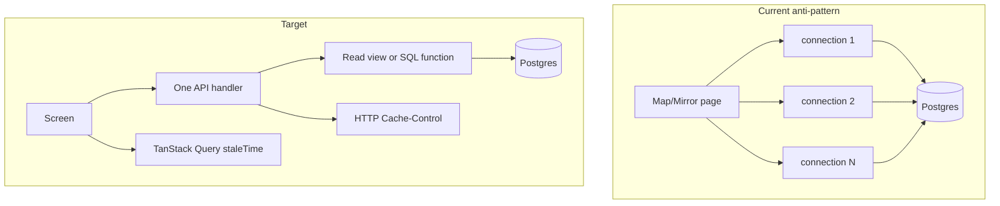
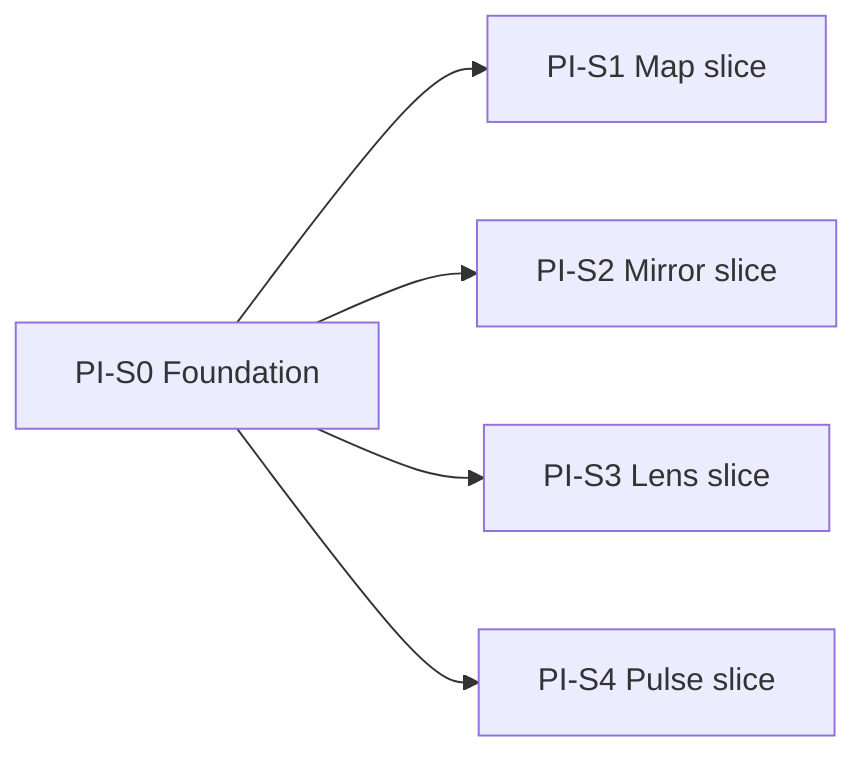

# Performance Improvement Phase

**Version:** v1.0 | **Date:** 07-06-2026  
**Status:** Locked — ready to execute  
**Related:** [performance-correction-pulse-mirror.md](performance-correction-pulse-mirror.md) (supersedes PC-3.2, PC-3.3, PC-5.1, PC-5.3), [cross-phase-performance-standards.md](cross-phase-performance-standards.md)

---

## Locked decisions (do not reopen)

| ID | Decision |
|----|----------|
| D1 | Cached SSR with real content; no skeleton expansion |
| D2 | Freshness: Pulse 60s + `last_updated`; Map 300s silent; Mirror 60s force refresh; banner if cache age > 24h on Pulse/Mirror |
| D3 | Intent loading = route contract + click + scroll-into-view + hover-dwell 250ms; no universal idle loading |
| D3b | Sector hover: prefetch summary on dwell; **abort in-flight** when focus moves to another sector before response |
| D4 | Thread prefetch: dwell 250ms, max 2 concurrent, LRU dedup 10; enable after Map API split ships |
| D5 | Map: Phase A = header + modules on entry; Phase B = matrix on scroll/tab/expand |
| D6 | TanStack Query: `staleTime` Pulse/Mirror 60s, Map 300s |
| D7 | SSR hydrate skip-refetch on all data pages; Lens history SSR in scope |
| D9 | Map `max-age=300` API + client staleTime |
| D14 | `public, max-age=60` on `/api/feed` when `session_id` and `personalisation_token` absent |
| D10-12 | DB views + single `connection()` per screen; no Redis; no colocation (deferred) |
| D-Pulse | Option A: mirror `session_id` + `personalisation_token` into cookies at onboarding so SSR can serve personalized feed; Option B fallback when cookies absent |

---

## Architecture target



---

## Execution model — parallel vertical slices

One migration commit unblocks all DB work. Then **four stories run in parallel**.



**Wave 0 (day 1, blocking):** PI-S0 only — migration + TanStack + shared prefetch hook  
**Wave 1 (parallel):** PI-S1, PI-S2, PI-S3, PI-S4 — no cross-story file conflicts if boundaries respected

---

## PI-S0 — Shared foundation

**Points:** 3 | **Blocks:** PI-S1–S4 DB portions

### User story

> As a platform engineer, I have one migration with all read views, TanStack Query wired in the app shell, and a reusable intent-prefetch hook with abort — so surface teams can execute in parallel without reinventing cancellation logic.

### Tasks

- [x] **0.1** Migration `backend/db/migrations/0029_performance_read_views.sql`:
  - `map_sector_list_v` — replaces `list_sectors` GROUP BY
  - `map_sector_summary_v(slug)` — sector + modules + instrument_count (no matrix)
  - `map_sector_matrix_v(slug)` — factors + instruments + sensitivities JSON
  - `mirror_user_predictions_v` — joined prediction rows for list + stats input
  - `mirror_user_streak_v` — last 14 mechanism grades per user
  - `mirror_graded_history_v` — graded resolved rows for gap detector input
  - `lens_user_queries_v` — recent queries per user (limit 20)
- [x] **0.2** Static SQL tests: `backend/tests/test_performance_views_migration_sql.py` (pattern from `test_feed_card_perf_migration_sql.py`)
- [x] **0.3** Install `@tanstack/react-query` in `frontend/package.json`; add `QueryClientProvider` in `frontend/app/(app)/layout.tsx`
- [x] **0.4** Shared hook `frontend/lib/perf/useIntentPrefetch.ts`:
  - `onPointerEnter(targetKey, fetchFn)` — start 250ms timer
  - `onPointerLeave` — clear timer; if dwell not met, no fetch
  - On fetch start: `abortController.abort()` previous; new `AbortController`
  - On response: apply only if `targetKey === focusedKey`
  - Module-level cap: max 2 in-flight; LRU dedup set (size 10)
  - Pass `signal` to `fetch()` for cancellation

### Intent-prefetch cancellation (D3b)

```
User hovers banking 300ms → fetch banking summary starts
User moves to IT at 400ms → abort banking fetch; start IT timer
Banking response arrives at 500ms → discarded (focusedKey !== banking)
IT dwell completes → fetch IT summary
User clicks IT → navigation; likely TanStack/Next cache hit
```

DB hit occurs only after 250ms declared intent. Aborted requests must not update UI or cache.

---

## PI-S1 — Map vertical slice

**Points:** 8 | **Depends on:** PI-S0 migration  
**Parallel with:** PI-S2, PI-S3, PI-S4

### User story

> As a signed-in user, I open a sector from The Map and see header + modules immediately; the sensitivity matrix loads when I scroll to it or expand it. Hovering a sector tile for 250ms preloads summary data; moving to another tile cancels the prior request.

### Backend

- [x] **1.1** Refactor `backend/app/services/map_content.py`:
  - `list_sectors()` → query `map_sector_list_v` (one `connection()`)
  - `fetch_sector_summary(slug)` → `map_sector_summary_v`
  - `fetch_sector_matrix(slug)` → `map_sector_matrix_v`; apply `MATRIX_PREVIEW_INSTRUMENT_LIMIT` in Python
  - Remove `factor_db_svc.fetch_matrix_rows` from hot path
- [x] **1.2** Extend `backend/app/api/map.py`:
  - `GET /api/map/sectors/{slug}` → summary only (`SectorSummaryDetailResponse`)
  - `GET /api/map/sectors/{slug}/matrix` → matrix payload
  - Add `Cache-Control: private, max-age=300` via new helpers in `backend/app/http/cache_control.py`
- [x] **1.3** Update `backend/tests/test_map_api.py`: summary/matrix split, single-connection assertion, cache headers

### Frontend

- [x] **1.4** `frontend/lib/api/mapServer.ts`: `revalidate: 300` on list + summary; `fetchMapSectorMatrix(slug)` with query staleTime
- [x] **1.5** `frontend/app/(app)/map/[slug]/page.tsx`: SSR summary only (not matrix)
- [x] **1.6** `frontend/app/(app)/map/_components/MapSectorClient.tsx`:
  - Render header + modules from SSR
  - `SensitivityMatrix` behind `IntersectionObserver` or explicit "Show sensitivity matrix" expand
  - Client fetch matrix on intent; skeleton inside matrix section only
- [x] **1.7** `frontend/app/(app)/map/_components/SectorTile.tsx`: wire `useIntentPrefetch` → prefetch `/api/map/sectors/{slug}` summary into TanStack cache (not matrix)
- [x] **1.8** Types in `frontend/lib/map/types.ts`: split `MapSectorSummaryDetail` vs `MapSectorMatrixResponse`

### Acceptance

- Map index: 1 DB connection, 1 query
- Map sector summary: 1 connection; matrix is separate request on intent
- Hover banking → IT before response: banking result discarded; no wrong-sector flash
- Warm return < 5 min: served from cache (API + TanStack)

---

## PI-S2 — Mirror vertical slice

**Points:** 5 | **Depends on:** PI-S0 migration  
**Parallel with:** PI-S1, PI-S3, PI-S4

### User story

> As a signed-in user, my Mirror dashboard loads in one DB round-trip on SSR. Returning within 60s shows data instantly with silent background refresh; after 24h away I see a refresh without blanking the page.

### Backend

- [x] **2.1** New service `backend/app/services/mirror_dashboard.py`:
  - One `with connection()` block
  - Queries `mirror_user_predictions_v`, `mirror_user_streak_v`, `mirror_graded_history_v` in same cursor
  - Compute stats via existing `compute()` in `backend/app/services/mirror_stats.py`
  - Compute gaps via `analyse_from_history()` (pass pre-fetched rows, no second connection)
  - Unread notifications in same connection (move SQL from `backend/app/api/mirror.py`)
- [x] **2.2** Slim `backend/app/api/mirror.py` `get_mirror_dashboard` to call `mirror_dashboard.py` only
- [x] **2.3** Tests: `backend/tests/test_mirror_routes.py` — assert `connection()` called once (mock/patch pattern from `test_query_consolidation.py`)

### Frontend

- [x] **2.4** TanStack query hook `frontend/lib/mirror/useMirrorDashboard.ts`: `staleTime: 60_000`, `placeholderData: initialPayload`
- [x] **2.5** `frontend/app/(app)/mirror/_components/MirrorClient.tsx`:
  - Use hook; skip mount refetch when SSR hydrated
  - `refetchOnMount` if `Date.now() - lastFetch > 60_000`
  - Banner component when `> 24h` since last successful fetch
- [x] **2.6** `frontend/lib/api/mirrorServer.ts`: keep `revalidate: 60`

### Acceptance

- `GET /api/mirror/dashboard`: 1 pool checkout, ≤4 SQL statements in one transaction
- No full-page skeleton when SSR data exists
- Filter change: predictions-only refetch unchanged (D8 closed)

---

## PI-S3 — Lens vertical slice

**Points:** 5 | **Depends on:** PI-S0 migration  
**Parallel with:** PI-S1, PI-S2, PI-S4

### User story

> As a signed-in user, my Lens query history is server-rendered on first paint. History does not trigger a client mount fetch when SSR data is present.

### Backend

- [x] **3.1** Refactor `backend/app/services/lens_queries.py` `list_recent_for_user` → query `lens_user_queries_v` (single connection — consolidate existing multi-connection reads)
- [x] **3.2** Tests: `backend/tests/test_lens_routes.py`

### Frontend

- [x] **3.3** New `frontend/lib/api/lensServer.ts`: `fetchLensHistory(accessToken)` with `revalidate: 60`
- [x] **3.4** New `frontend/app/(app)/lens/LensContentSection.tsx` async RSC boundary (mirror `MirrorContentSection.tsx`)
- [x] **3.5** `frontend/app/(app)/lens/page.tsx`: use content section + Suspense
- [x] **3.6** `frontend/app/(app)/lens/_components/LensClient.tsx`: accept `initialHistory`; skip `loadHistory` on mount when hydrated; history is Tier 1 for `/lens` route contract

### Acceptance

- Lens history visible in HTML without client waterfall
- New query submission still refetches history (mutation path)

---

## PI-S4 — Pulse + feed cache + prefetch vertical slice

**Points:** 8 | **Depends on:** PI-S0 (TanStack + prefetch hook)  
**Parallel with:** PI-S1, PI-S2, PI-S3  
**Soft dependency:** enable thread `prefetch` after PI-S1 Map API bench confirms < 800ms warm

### User story

> As a user, Pulse loads real cards from SSR without a client refetch unless I have holdings personalization. Default feed is edge-cacheable. Hovering a card 250ms prefetches Thread. Market facts and notifications load after feed paint.

### Backend — feed cache (D14)

- [x] **4.1** `backend/app/http/cache_control.py`:
  - `PUBLIC_FEED_CACHE = "public, max-age=60, stale-while-revalidate=300"`
  - `cache_control_for_feed(session_id, personalisation_token)` → public when both absent, else private
- [x] **4.2** `backend/app/api/feed.py`: pass params to cache helper
- [x] **4.3** Tests: `backend/tests/test_http_cache.py` — public vs personalized variants

### Frontend — personalization cookies (Option A)

- [x] **4.4** On onboarding completion: set HTTP-only or secure cookies `finnwise_session_id`, `finnwise_personalisation_token` (alongside existing localStorage in `frontend/lib/sessionProfile.ts` / holdings flow)
- [x] **4.5** `frontend/app/(app)/pulse/page.tsx`: read cookies server-side; pass to `fetchPulseFeed({ sessionId, personalisationToken, category })`
- [x] **4.6** `frontend/lib/api/server.ts`: extend `PulseFeedFetchOptions` with optional token
- [x] **4.7** `frontend/lib/cards/usePulseFeed.ts`:
  - TanStack Query wrapper; `staleTime: 60_000`
  - Skip client refetch when SSR params match (including token when cookie present)
  - Option B fallback: refetch only if `getPersonalisationToken()` returns value AND differs from SSR
  - Background refresh if `last_updated` age > 60s; banner if > 24h

### Frontend — defer Tier 2 (D3)

- [x] **4.8** `frontend/components/market-facts/MarketFactsStrip.tsx` / `frontend/lib/marketFacts/useMarketFacts.ts`: defer until after feed success + `requestIdleCallback`
- [x] **4.9** Notification badge: defer + dedupe (per `performance-correction-pulse-mirror.md` PC-1.2)

### Frontend — prefetch (D4)

- [x] **4.10** `frontend/app/(app)/pulse/_components/PulseFeedList.tsx`: remove `prefetch={false}` once warm bench green
- [x] **4.11** `frontend/app/(app)/pulse/_components/EventCard.tsx`: `useIntentPrefetch` → `router.prefetch(/thread/{id})` on dwell 250ms

### Acceptance

- `curl /api/feed` → `public, max-age=60`
- `curl /api/feed?personalisation_token=x` → `private, max-age=60`
- Holdings user: no card reorder on hydration when cookie SSR matches
- No client feed fetch on mount for default anonymous SSR
- Thread navigation after dwell: measurable prefetch cache hit

---

## Definition of done (phase exit)

| Metric | Target |
|--------|--------|
| DB connections per screen | Map summary 1; Map matrix 1 on intent; Mirror dashboard 1; Lens history 1; Feed 1 (unchanged) |
| Map sector first paint | Header + modules without matrix payload |
| Warm API | Feed + map summary p95 < 800ms local direct bench |
| Intent prefetch | Aborted requests never mutate UI |
| CI | `ruff`, `pytest`, `pnpm lint/typecheck/test/build` green |
| No new materialized views | Unless `EXPLAIN ANALYZE` > 300ms post-view deploy |

---

## File ownership (avoid merge conflicts during parallel work)

| Story | Primary backend files | Primary frontend files |
|-------|----------------------|------------------------|
| PI-S0 | `0029_*.sql`, `test_performance_views_migration_sql.py` | `layout.tsx`, `useIntentPrefetch.ts` |
| PI-S1 | `map_content.py`, `map.py`, `cache_control.py` | `map/**`, `mapServer.ts`, `map/types.ts` |
| PI-S2 | `mirror_dashboard.py`, `mirror.py` | `mirror/**`, `useMirrorDashboard.ts` |
| PI-S3 | `lens_queries.py` | `lens/**`, `lensServer.ts` |
| PI-S4 | `cache_control.py`, `feed.py`, `test_http_cache.py` | `pulse/**`, `usePulseFeed.ts`, cookies, `EventCard.tsx` |

**Conflict note:** PI-S1 and PI-S4 both touch `cache_control.py` — coordinate: PI-S1 adds `MAP_READ_CACHE`; PI-S4 adds `PUBLIC_FEED_CACHE` in separate functions. Merge both in S0 if needed.

---

## Rejected / deferred (record only)

- Redis layer
- Regional colocation (D13)
- Skeleton expansion (D1)
- Mirror partial refetch further work (D8)
- Materialized views in initial delivery

---

## Execution checklist (story order)

| Order | Story | Gate |
|-------|-------|------|
| 1 | PI-S0 | Migration applied locally + CI green ✓ |
| 2a | PI-S1 | Parallel ✓ |
| 2b | PI-S2 | Parallel |
| 2c | PI-S3 | Parallel ✓ |
| 2d | PI-S4 | Parallel ✓ |
| 3 | Phase exit | Bench + CI + manual smoke on Map/Mirror/Lens/Pulse |
