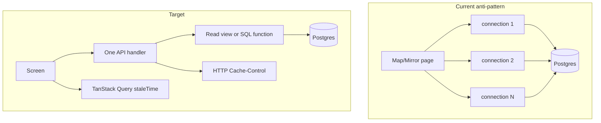
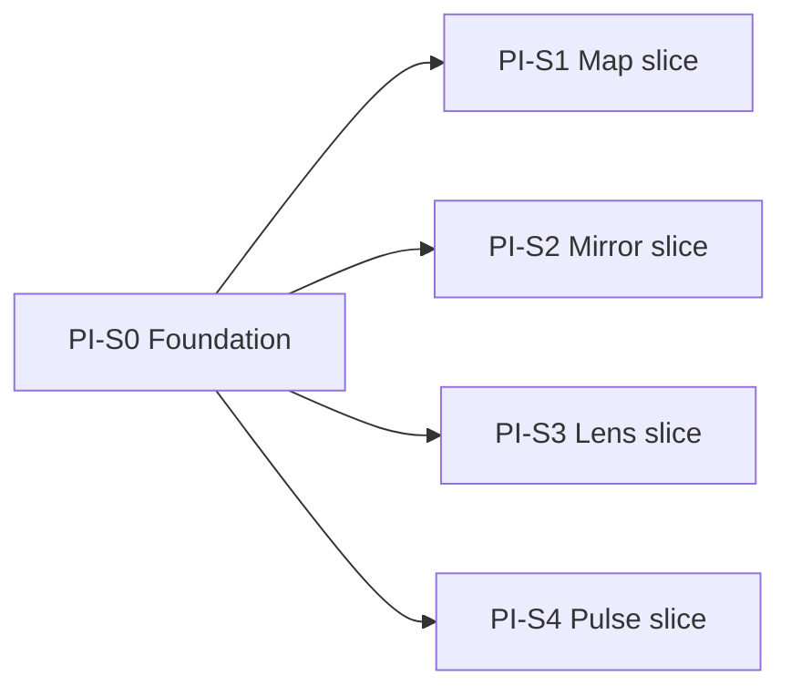
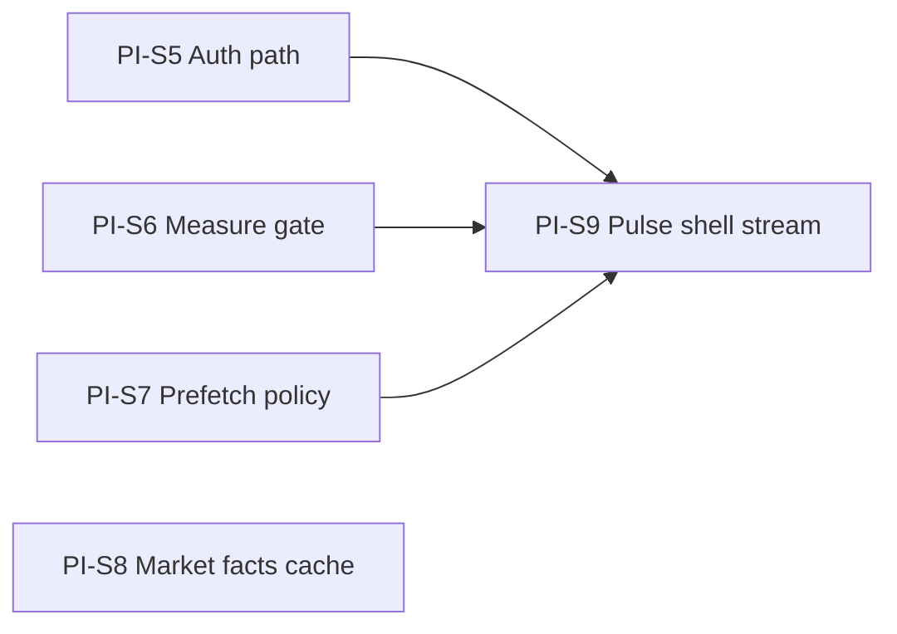

# Performance Improvement Phase

**Version:** v1.1 | **Date:** 08-06-2026  
**Status:** Wave 1 complete — Wave 2 (production sign-in → Pulse) ready to execute  
**Related:** [performance-correction-pulse-mirror.md](performance-correction-pulse-mirror.md) (supersedes PC-3.2, PC-3.3, PC-5.1, PC-5.3), [cross-phase-performance-standards.md](cross-phase-performance-standards.md)

---

## Locked decisions (do not reopen)

| ID | Decision |
|----|----------|
| D1 | Cached SSR with real content; no skeleton expansion |
| D2 | Freshness: Pulse 60s + `last_updated`; Map 300s silent; Mirror 60s force refresh; banner if cache age > 24h on Pulse/Mirror |
| D3 | Intent loading = route contract + click + scroll-into-view + hover-dwell 250ms; no universal idle loading |
| D3b | Sector hover: prefetch summary on dwell; **abort in-flight** when focus moves to another sector before response |
| D4 | Thread prefetch: dwell 250ms, max 2 concurrent, LRU dedup 10; enable after Map API split ships |
| D5 | Map: Phase A = header + modules on entry; Phase B = matrix on scroll/tab/expand |
| D6 | TanStack Query: `staleTime` Pulse/Mirror 60s, Map 300s |
| D7 | SSR hydrate skip-refetch on all data pages; Lens history SSR in scope |
| D9 | Map `max-age=300` API + client staleTime |
| D14 | `public, max-age=60` on `/api/feed` when `session_id` and `personalisation_token` absent |
| D10-12 | DB views + single `connection()` per screen; no Redis; no colocation (deferred) |
| D-Pulse | Option A: mirror `session_id` + `personalisation_token` into cookies at onboarding so SSR can serve personalized feed; Option B fallback when cookies absent |
| D15 | **Amend D3/D4 (Wave 2):** sidebar nav `Link` default prefetch off; thread/card RSC prefetch intent-only (dwell 250ms). PI-S4.10–4.11 superseded for idle prefetch. |
| D16 | Feed DB views: **prove-or-skip** — `EXPLAIN ANALYZE` on existing feed CTE first; add `pulse_feed_v` only if `db_query_ms` > 300ms on production path. Feed already uses 1 `connection()` + bundled CTE — views are not default. |
| D17 | Market facts: **snapshot table** written by background job; `/api/market-facts` reads DB only (no live Yahoo/NSE/RBI on request path). |
| D18 | Sign-in → Pulse: no `router.refresh()` after successful `router.push()`; suppress stale Supabase `refresh_token` attempt on sign-in page mount. |

**Production evidence (08-06-2026):** sign-in `OPTIONS` ~15s (Supabase); `pulse?_rsc` ~2.4s; `market-facts` ~2.2s (live scrape); `saved-threads` ~2.9s; sidebar RSC prefetch storm after Pulse mount. Local dev 8s Pulse RSC not representative — optimize against production traces only.

---

## Architecture target



---

## Execution model — parallel vertical slices

One migration commit unblocks all DB work. Then **four stories run in parallel**.



**Wave 0 (day 1, blocking):** PI-S0 only — migration + TanStack + shared prefetch hook  
**Wave 1 (parallel):** PI-S1, PI-S2, PI-S3, PI-S4 — no cross-story file conflicts if boundaries respected

---

## PI-S0 — Shared foundation

**Points:** 3 | **Blocks:** PI-S1–S4 DB portions

### User story

> As a platform engineer, I have one migration with all read views, TanStack Query wired in the app shell, and a reusable intent-prefetch hook with abort — so surface teams can execute in parallel without reinventing cancellation logic.

### Tasks

- [x] **0.1** Migration `backend/db/migrations/0029_performance_read_views.sql`:
  - `map_sector_list_v` — replaces `list_sectors` GROUP BY
  - `map_sector_summary_v(slug)` — sector + modules + instrument_count (no matrix)
  - `map_sector_matrix_v(slug)` — factors + instruments + sensitivities JSON
  - `mirror_user_predictions_v` — joined prediction rows for list + stats input
  - `mirror_user_streak_v` — last 14 mechanism grades per user
  - `mirror_graded_history_v` — graded resolved rows for gap detector input
  - `lens_user_queries_v` — recent queries per user (limit 20)
- [x] **0.2** Static SQL tests: `backend/tests/test_performance_views_migration_sql.py` (pattern from `test_feed_card_perf_migration_sql.py`)
- [x] **0.3** Install `@tanstack/react-query` in `frontend/package.json`; add `QueryClientProvider` in `frontend/app/(app)/layout.tsx`
- [x] **0.4** Shared hook `frontend/lib/perf/useIntentPrefetch.ts`:
  - `onPointerEnter(targetKey, fetchFn)` — start 250ms timer
  - `onPointerLeave` — clear timer; if dwell not met, no fetch
  - On fetch start: `abortController.abort()` previous; new `AbortController`
  - On response: apply only if `targetKey === focusedKey`
  - Module-level cap: max 2 in-flight; LRU dedup set (size 10)
  - Pass `signal` to `fetch()` for cancellation

### Intent-prefetch cancellation (D3b)

```
User hovers banking 300ms → fetch banking summary starts
User moves to IT at 400ms → abort banking fetch; start IT timer
Banking response arrives at 500ms → discarded (focusedKey !== banking)
IT dwell completes → fetch IT summary
User clicks IT → navigation; likely TanStack/Next cache hit
```

DB hit occurs only after 250ms declared intent. Aborted requests must not update UI or cache.

---

## PI-S1 — Map vertical slice

**Points:** 8 | **Depends on:** PI-S0 migration  
**Parallel with:** PI-S2, PI-S3, PI-S4

### User story

> As a signed-in user, I open a sector from The Map and see header + modules immediately; the sensitivity matrix loads when I scroll to it or expand it. Hovering a sector tile for 250ms preloads summary data; moving to another tile cancels the prior request.

### Backend

- [x] **1.1** Refactor `backend/app/services/map_content.py`:
  - `list_sectors()` → query `map_sector_list_v` (one `connection()`)
  - `fetch_sector_summary(slug)` → `map_sector_summary_v`
  - `fetch_sector_matrix(slug)` → `map_sector_matrix_v`; apply `MATRIX_PREVIEW_INSTRUMENT_LIMIT` in Python
  - Remove `factor_db_svc.fetch_matrix_rows` from hot path
- [x] **1.2** Extend `backend/app/api/map.py`:
  - `GET /api/map/sectors/{slug}` → summary only (`SectorSummaryDetailResponse`)
  - `GET /api/map/sectors/{slug}/matrix` → matrix payload
  - Add `Cache-Control: private, max-age=300` via new helpers in `backend/app/http/cache_control.py`
- [x] **1.3** Update `backend/tests/test_map_api.py`: summary/matrix split, single-connection assertion, cache headers

### Frontend

- [x] **1.4** `frontend/lib/api/mapServer.ts`: `revalidate: 300` on list + summary; `fetchMapSectorMatrix(slug)` with query staleTime
- [x] **1.5** `frontend/app/(app)/map/[slug]/page.tsx`: SSR summary only (not matrix)
- [x] **1.6** `frontend/app/(app)/map/_components/MapSectorClient.tsx`:
  - Render header + modules from SSR
  - `SensitivityMatrix` behind `IntersectionObserver` or explicit "Show sensitivity matrix" expand
  - Client fetch matrix on intent; skeleton inside matrix section only
- [x] **1.7** `frontend/app/(app)/map/_components/SectorTile.tsx`: wire `useIntentPrefetch` → prefetch `/api/map/sectors/{slug}` summary into TanStack cache (not matrix)
- [x] **1.8** Types in `frontend/lib/map/types.ts`: split `MapSectorSummaryDetail` vs `MapSectorMatrixResponse`

### Acceptance

- Map index: 1 DB connection, 1 query
- Map sector summary: 1 connection; matrix is separate request on intent
- Hover banking → IT before response: banking result discarded; no wrong-sector flash
- Warm return < 5 min: served from cache (API + TanStack)

---

## PI-S2 — Mirror vertical slice

**Points:** 5 | **Depends on:** PI-S0 migration  
**Parallel with:** PI-S1, PI-S3, PI-S4

### User story

> As a signed-in user, my Mirror dashboard loads in one DB round-trip on SSR. Returning within 60s shows data instantly with silent background refresh; after 24h away I see a refresh without blanking the page.

### Backend

- [x] **2.1** New service `backend/app/services/mirror_dashboard.py`:
  - One `with connection()` block
  - Queries `mirror_user_predictions_v`, `mirror_user_streak_v`, `mirror_graded_history_v` in same cursor
  - Compute stats via existing `compute()` in `backend/app/services/mirror_stats.py`
  - Compute gaps via `analyse_from_history()` (pass pre-fetched rows, no second connection)
  - Unread notifications in same connection (move SQL from `backend/app/api/mirror.py`)
- [x] **2.2** Slim `backend/app/api/mirror.py` `get_mirror_dashboard` to call `mirror_dashboard.py` only
- [x] **2.3** Tests: `backend/tests/test_mirror_routes.py` — assert `connection()` called once (mock/patch pattern from `test_query_consolidation.py`)

### Frontend

- [x] **2.4** TanStack query hook `frontend/lib/mirror/useMirrorDashboard.ts`: `staleTime: 60_000`, `placeholderData: initialPayload`
- [x] **2.5** `frontend/app/(app)/mirror/_components/MirrorClient.tsx`:
  - Use hook; skip mount refetch when SSR hydrated
  - `refetchOnMount` if `Date.now() - lastFetch > 60_000`
  - Banner component when `> 24h` since last successful fetch
- [x] **2.6** `frontend/lib/api/mirrorServer.ts`: keep `revalidate: 60`

### Acceptance

- `GET /api/mirror/dashboard`: 1 pool checkout, ≤4 SQL statements in one transaction
- No full-page skeleton when SSR data exists
- Filter change: predictions-only refetch unchanged (D8 closed)

---

## PI-S3 — Lens vertical slice

**Points:** 5 | **Depends on:** PI-S0 migration  
**Parallel with:** PI-S1, PI-S2, PI-S4

### User story

> As a signed-in user, my Lens query history is server-rendered on first paint. History does not trigger a client mount fetch when SSR data is present.

### Backend

- [x] **3.1** Refactor `backend/app/services/lens_queries.py` `list_recent_for_user` → query `lens_user_queries_v` (single connection — consolidate existing multi-connection reads)
- [x] **3.2** Tests: `backend/tests/test_lens_routes.py`

### Frontend

- [x] **3.3** New `frontend/lib/api/lensServer.ts`: `fetchLensHistory(accessToken)` with `revalidate: 60`
- [x] **3.4** New `frontend/app/(app)/lens/LensContentSection.tsx` async RSC boundary (mirror `MirrorContentSection.tsx`)
- [x] **3.5** `frontend/app/(app)/lens/page.tsx`: use content section + Suspense
- [x] **3.6** `frontend/app/(app)/lens/_components/LensClient.tsx`: accept `initialHistory`; skip `loadHistory` on mount when hydrated; history is Tier 1 for `/lens` route contract

### Acceptance

- Lens history visible in HTML without client waterfall
- New query submission still refetches history (mutation path)

---

## PI-S4 — Pulse + feed cache + prefetch vertical slice

**Points:** 8 | **Depends on:** PI-S0 (TanStack + prefetch hook)  
**Parallel with:** PI-S1, PI-S2, PI-S3  
**Soft dependency:** enable thread `prefetch` after PI-S1 Map API bench confirms < 800ms warm

### User story

> As a user, Pulse loads real cards from SSR without a client refetch unless I have holdings personalization. Default feed is edge-cacheable. Hovering a card 250ms prefetches Thread. Market facts and notifications load after feed paint.

### Backend — feed cache (D14)

- [x] **4.1** `backend/app/http/cache_control.py`:
  - `PUBLIC_FEED_CACHE = "public, max-age=60, stale-while-revalidate=300"`
  - `cache_control_for_feed(session_id, personalisation_token)` → public when both absent, else private
- [x] **4.2** `backend/app/api/feed.py`: pass params to cache helper
- [x] **4.3** Tests: `backend/tests/test_http_cache.py` — public vs personalized variants

### Frontend — personalization cookies (Option A)

- [x] **4.4** On onboarding completion: set HTTP-only or secure cookies `finnwise_session_id`, `finnwise_personalisation_token` (alongside existing localStorage in `frontend/lib/sessionProfile.ts` / holdings flow)
- [x] **4.5** `frontend/app/(app)/pulse/page.tsx`: read cookies server-side; pass to `fetchPulseFeed({ sessionId, personalisationToken, category })`
- [x] **4.6** `frontend/lib/api/server.ts`: extend `PulseFeedFetchOptions` with optional token
- [x] **4.7** `frontend/lib/cards/usePulseFeed.ts`:
  - TanStack Query wrapper; `staleTime: 60_000`
  - Skip client refetch when SSR params match (including token when cookie present)
  - Option B fallback: refetch only if `getPersonalisationToken()` returns value AND differs from SSR
  - Background refresh if `last_updated` age > 60s; banner if > 24h

### Frontend — defer Tier 2 (D3)

- [x] **4.8** `frontend/components/market-facts/MarketFactsStrip.tsx` / `frontend/lib/marketFacts/useMarketFacts.ts`: defer until after feed success + `requestIdleCallback`
- [x] **4.9** Notification badge: defer + dedupe (per `performance-correction-pulse-mirror.md` PC-1.2)

### Frontend — prefetch (D4)

- [x] **4.10** `frontend/app/(app)/pulse/_components/PulseFeedList.tsx`: remove `prefetch={false}` once warm bench green
- [x] **4.11** `frontend/app/(app)/pulse/_components/EventCard.tsx`: `useIntentPrefetch` → `router.prefetch(/thread/{id})` on dwell 250ms

### Acceptance

- `curl /api/feed` → `public, max-age=60`
- `curl /api/feed?personalisation_token=x` → `private, max-age=60`
- Holdings user: no card reorder on hydration when cookie SSR matches
- No client feed fetch on mount for default anonymous SSR
- Thread navigation after dwell: measurable prefetch cache hit

---

## Definition of done (phase exit)

| Metric | Target |
|--------|--------|
| DB connections per screen | Map summary 1; Map matrix 1 on intent; Mirror dashboard 1; Lens history 1; Feed 1 (unchanged) |
| Map sector first paint | Header + modules without matrix payload |
| Warm API | Feed + map summary p95 < 800ms local direct bench |
| Intent prefetch | Aborted requests never mutate UI |
| CI | `ruff`, `pytest`, `pnpm lint/typecheck/test/build` green |
| No new materialized views | Unless `EXPLAIN ANALYZE` > 300ms post-view deploy |

---

## File ownership (avoid merge conflicts during parallel work)

| Story | Primary backend files | Primary frontend files |
|-------|----------------------|------------------------|
| PI-S0 | `0029_*.sql`, `test_performance_views_migration_sql.py` | `layout.tsx`, `useIntentPrefetch.ts` |
| PI-S1 | `map_content.py`, `map.py`, `cache_control.py` | `map/**`, `mapServer.ts`, `map/types.ts` |
| PI-S2 | `mirror_dashboard.py`, `mirror.py` | `mirror/**`, `useMirrorDashboard.ts` |
| PI-S3 | `lens_queries.py` | `lens/**`, `lensServer.ts` |
| PI-S4 | `cache_control.py`, `feed.py`, `test_http_cache.py` | `pulse/**`, `usePulseFeed.ts`, cookies, `EventCard.tsx` |
| PI-S5 | — | `sign-in/**` |
| PI-S6 | `feed.py` (EXPLAIN) | `scripts/bench_*.mjs` |
| PI-S7 | — | `Sidebar.tsx`, `PulseFeedList.tsx` |
| PI-S8 | `market_facts*.sql`, `market_facts.py`, signal job | `useMarketFacts.ts` |
| PI-S9 | optional gated migration | `pulse/page.tsx`, `SavedThreadsNav.tsx` |

**Conflict note:** PI-S1 and PI-S4 both touch `cache_control.py` — coordinate: PI-S1 adds `MAP_READ_CACHE`; PI-S4 adds `PUBLIC_FEED_CACHE` in separate functions. Merge both in S0 if needed. PI-S8 and PI-S9 migrations: separate files; PI-S9 view migration only if PI-S6 gate fails.

---

## Rejected / deferred (record only)

- Redis layer
- Regional colocation (D13) — revisit only if PI-S6 shows proxy RTT dominates and `db_query_ms` is low
- Skeleton expansion (D1)
- Mirror partial refetch further work (D8)
- Materialized views in Wave 1 — Wave 2: feed matview only if PI-S6 gate fails (D16)
- Live external scrape on `/api/market-facts` request path — superseded by D17 (PI-S8)

---

## Execution checklist (story order)

| Order | Story | Gate |
|-------|-------|------|
| 1 | PI-S0 | Migration applied locally + CI green ✓ |
| 2a | PI-S1 | Parallel ✓ |
| 2b | PI-S2 | Parallel |
| 2c | PI-S3 | Parallel ✓ |
| 2d | PI-S4 | Parallel ✓ |
| 3 | Phase exit (Wave 1) | Bench + CI + manual smoke on Map/Mirror/Lens/Pulse ✓ |
| 4 | PI-S5 | Auth + sign-in navigation — blocks perceived sign-in wall clock |
| 5 | PI-S6 | Measurement gate — blocks feed view decision |
| 6a | PI-S7 | Parallel with PI-S8, PI-S9 |
| 6b | PI-S8 | Parallel with PI-S7, PI-S9 |
| 6c | PI-S9 | Parallel with PI-S7, PI-S8; depends on PI-S6 gate for optional views |
| 7 | Wave 2 exit | Production Network trace: sign-in → Pulse cards < 2.5s filmstrip; Tier-2 APIs deferred |

---

## Wave 2 — Production sign-in → Pulse (08-06-2026)

**Trigger:** Production Network traces show Wave 1 architecture is correct but incomplete. Dominant gaps are outside PI-S0–S4 scope: Supabase auth preflight, idle RSC prefetch, live market-facts scrape, undiffered shell fetches.

**Execution model:**



**Wave 2 (day 1):** PI-S5 + PI-S6 (blocking — measure before schema changes)  
**Wave 2 (parallel):** PI-S7, PI-S8, PI-S9 after S5/S6 gates pass

**View policy (D16):** Map/Mirror/Lens views shipped in PI-S0. Pulse feed **does not** get a view by default. `saved_threads_nav_v` is optional consistency only. Market facts use a **snapshot table**, not a read view.

---

## PI-S5 — Auth + sign-in navigation

**Points:** 3 | **Blocks:** PI-S9 (clean post-auth RSC timing)  
**Parallel with:** PI-S6

### User story

> As a returning tester, I click Sign in with password and reach Pulse without waiting on a stale session refresh or a redundant full-page server refresh. Auth preflight completes in under one second on production.

### Frontend

- [ ] **5.1** `frontend/app/(auth)/sign-in/sign-in-form.tsx`: after successful `signInWithPassword`, use `router.replace(nextPath)` only — remove `router.refresh()` (D18).
- [ ] **5.2** Sign-in page: prevent Supabase client from firing `refresh_token` with an invalid/expired cookie before user submits — clear stale auth storage on sign-in mount or use a sign-in-scoped client that skips auto-refresh until post-login.
- [ ] **5.3** Tests: `sign-in-form.test.tsx` — assert `replace` called once, `refresh` not called on success path.

### Ops / verification (no code if config-only)

- [ ] **5.4** Record Supabase project region vs Vercel deployment region; document RTT if `OPTIONS` remains > 1s after 5.2.
- [ ] **5.5** Production Network acceptance: `token?grant_type=password` preflight < 1s; no parallel failing `refresh_token` 400 before password POST.

### Acceptance

- Password POST still < 500ms once preflight completes.
- Single Pulse RSC navigation after sign-in (no duplicate `pulse?_rsc` from push + refresh).
- Documented Supabase region note in PR or close-out comment.

---

## PI-S6 — Production measurement gate

**Points:** 2 | **Blocks:** PI-S9 feed view decision (D16)  
**Parallel with:** PI-S5

### User story

> As a platform engineer, I have timing evidence from the production proxy path before changing feed SQL or adding views — so schema work targets proven query latency, not assumed multi-query debt.

### Measurement

- [ ] **6.1** Capture `X-FinnWise-Timing` on `GET /api/feed` and `GET /api/saved-threads` through Vercel `/backend` proxy (production or preview) during cold and warm requests.
- [ ] **6.2** Run `EXPLAIN (ANALYZE, BUFFERS)` on the feed bundled CTE (`_fetch_feed_bundle_conn` in `backend/app/services/feed.py`) against production-scale data; record `db_query_ms` equivalent.
- [ ] **6.3** Extend `scripts/bench_api_latency.mjs` (or add `scripts/bench_proxy_timing.mjs`) to parse and report `db_connect_ms`, `db_query_ms`, `total_ms` from response headers.
- [ ] **6.4** **Decision gate (D16):**
  - If `db_query_ms` ≤ 300ms → **skip** `pulse_feed_v`; prioritize streaming SSR (PI-S9) and proxy/cache path.
  - If `db_query_ms` > 300ms → add diagnostic `pulse_feed_v` in new migration + static SQL test; re-benchmark before considering materialized view.

### Acceptance

- Written timing breakdown for feed and saved-threads on production path.
- Explicit go/no-go on `pulse_feed_v` recorded in PR.
- No migration added without passing 6.4 gate.

---

## PI-S7 — Prefetch policy (D15)

**Points:** 3 | **Depends on:** none (frontend-only)  
**Parallel with:** PI-S8, PI-S9

### User story

> As a signed-in user opening Pulse, the app does not idle-prefetch Mirror, Lens, Map, Thread routes or card RSC payloads until I show intent (hover dwell 250ms or click). Network tab stays quiet after Pulse first paint.

### Frontend

- [ ] **7.1** `frontend/components/Sidebar/Sidebar.tsx`: `Link prefetch={false}` on all `SIDEBAR_NAV_ITEMS` (D15).
- [ ] **7.2** `frontend/app/(app)/pulse/_components/PulseFeedList.tsx`: set `prefetch={false}` on mobile feed links — PI-S4.10 superseded; thread prefetch remains on `EventCard` dwell only (D4).
- [ ] **7.3** Audit other `(app)` nav `Link` components for default prefetch; align with D3.
- [ ] **7.4** Tests: Pulse feed list does not set link prefetch; EventCard still calls `router.prefetch` after dwell.

### Acceptance

- Production Network trace after Pulse mount: no burst of `thread`, `mirror`, `lens`, `map` `_rsc` prefetches without user interaction.
- Card UUID `_rsc` prefetches absent until hover dwell on desktop or navigation click.

---

## PI-S8 — Market facts snapshot cache (D17)

**Points:** 5 | **Depends on:** none  
**Parallel with:** PI-S7, PI-S9

### User story

> As a user on Pulse, market fact chips appear quickly after the feed paints because the API reads a recent DB snapshot — not live external quote chains on every request.

### Backend

- [ ] **8.1** Migration `backend/db/migrations/00XX_market_facts_snapshots.sql`:
  - Table `market_facts_snapshots` (or `market_fact_chips` rows): `fact_id`, `label`, `display_value`, `observed_at`, `source`, `freshness_status`, `reference_time`, `written_at`.
  - Index on `written_at DESC` for latest snapshot read.
- [ ] **8.2** Static SQL tests: `backend/tests/test_market_facts_snapshots_migration_sql.py`.
- [ ] **8.3** Extend `signal_monitor` job (or dedicated `market_facts_refresh` job) to call `evaluate_critical_facts_gate` and upsert snapshot rows on schedule (e.g. every 5–15 min).
- [ ] **8.4** Refactor `backend/app/api/market_facts.py` `get_market_facts` to read latest snapshot; return `degraded` / `has_stale_critical` from stored freshness metadata. No live HTTP on request path.
- [ ] **8.5** `Cache-Control: public, max-age=60` on snapshot read when product-safe.
- [ ] **8.6** Tests: `backend/tests/test_market_facts_api.py` — API does not call external fetchers; serves last snapshot; 503 or empty degraded when snapshot missing.

### Frontend

- [ ] **8.7** `frontend/lib/marketFacts/useMarketFacts.ts`: TanStack Query wrapper with `staleTime: 60_000` and shared query key (dedupe Strict Mode double fetch in dev).

### Acceptance

- `GET /api/market-facts` p95 < 200ms warm on production proxy path.
- Chips still defer until feed ready (PI-S4.8 unchanged).
- Job failure surfaces `degraded: true` in UI, not 15s hang.

---

## PI-S9 — Pulse shell streaming + Tier-2 defer

**Points:** 5 | **Depends on:** PI-S5, PI-S6 gate  
**Parallel with:** PI-S7, PI-S8

### User story

> As a user, I see the Pulse shell (layout, topbar, nav) within one second while the feed streams in. Saved threads in the sidebar load after feed paint, not in competition with the feed SSR.

### Frontend — streaming SSR (PC-2.1)

- [ ] **9.1** Split `frontend/app/(app)/pulse/page.tsx`:
  - Shell + `PulseClient` frame render immediately.
  - Feed data in nested async RSC boundary + `Suspense` (mirror `MirrorContentSection` / `LensContentSection` pattern).
- [ ] **9.2** Pass `initialData` from Suspense child into `PulseClient`; preserve TanStack hydrate-skip behavior (D7).
- [ ] **9.3** `loading.tsx` or inline fallback: minimal topbar skeleton only — no full feed skeleton expansion (D1).

### Frontend — saved threads defer

- [ ] **9.4** `frontend/components/Sidebar/SavedThreadsNav.tsx`: defer `load()` until `PULSE_FEED_READY_EVENT` (same contract as `NotificationBadge` on Pulse).
- [ ] **9.5** Optional: TanStack Query hook `useSavedThreads` with `staleTime: 60_000` for cross-navigation dedup.

### Backend — optional view (gated by PI-S6 only)

- [ ] **9.6** **If and only if PI-S6 gate fails:** migration adds `saved_threads_nav_v(user_id)` or `pulse_feed_v`; wire services; static SQL test. Skip if gate passes.

### Acceptance

- Production: Pulse topbar/shell visible before feed RSC completes.
- `saved-threads` fetch starts after `finnwise-pulse-feed-ready` event, not on sidebar mount.
- Feed path unchanged at 1 `connection()` unless PI-S6 mandates view.
- Sign-in → first feed card visible < 2.5s desktop filmstrip on production (after PI-S5).

---

## Wave 2 — Definition of done

| Metric | Target |
|--------|--------|
| Sign-in auth preflight | < 1s production |
| Sign-in → Pulse shell | < 1s after password POST |
| Sign-in → first feed card | < 2.5s desktop filmstrip production |
| `GET /api/market-facts` warm | p95 < 200ms (snapshot read) |
| Idle RSC prefetch after Pulse | None without user intent (D15) |
| Feed DB | 1 `connection()`; view added only if PI-S6 gate fails |
| CI | `ruff`, `pytest`, `pnpm lint/typecheck/test/build` green |

---

## Wave 2 — File ownership

| Story | Primary backend files | Primary frontend files |
|-------|----------------------|------------------------|
| PI-S5 | — | `sign-in/sign-in-form.tsx`, `sign-in-form.test.tsx` |
| PI-S6 | `feed.py` (EXPLAIN only) | `scripts/bench_api_latency.mjs` or new bench script |
| PI-S7 | — | `Sidebar.tsx`, `PulseFeedList.tsx`, `EventCard.tsx` |
| PI-S8 | `00XX_market_facts_snapshots.sql`, `market_facts.py`, `market_facts_adapters.py`, signal job | `useMarketFacts.ts` |
| PI-S9 | optional `00XX_*_v.sql` if gated | `pulse/page.tsx`, `SavedThreadsNav.tsx` |
